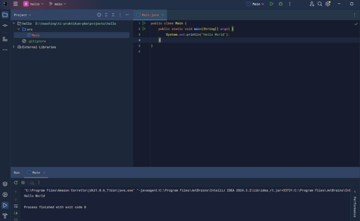
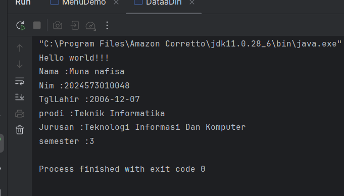

# Laporan Modul 1: Perkenalan Java dan Ekosistemnya
**Mata Kuliah:** Praktikum Pemrograman Berorientasi Objek   
**Nama:** [Muna nafisa]  
**NIM:** [2024573010048]  
**Kelas:** [TI2A]

---

## Abstrak
Java merupakan salah satu bahasa pemrograman yang populer dan banyak digunakan di berbagai bidang pengembangan perangkat lunak. Dikenal dengan prinsip write once, run anywhere (WORA), Java memungkinkan aplikasi dijalankan pada berbagai platform tanpa perlu melakukan penyesuaian yang signifikan. Ekosistem Java didukung oleh Java Development Kit (JDK), Java Virtual Machine (JVM), serta berbagai framework dan library yang memperluas fungsionalitasnya, mulai dari pengembangan aplikasi desktop, web, hingga perangkat bergerak. Selain itu, komunitas Java yang besar dan aktif turut menyediakan dokumentasi, dukungan, serta pembaruan berkelanjutan. Dengan stabilitas, keamanan, dan skalabilitas yang dimilikinya, Java tetap menjadi salah satu fondasi utama dalam dunia pemrograman modern dan teknologi informasi.

## 1. Pendahuluan
Perkembangan teknologi informasi yang semakin pesat mendorong kebutuhan akan bahasa pemrograman yang stabil, aman, dan mampu digunakan secara luas di berbagai platform. Java merupakan salah satu bahasa pemrograman yang memenuhi kebutuhan tersebut. Sejak pertama kali diperkenalkan oleh Sun Microsystems pada tahun 1995, Java telah menjadi salah satu bahasa yang paling populer dan berpengaruh di dunia pemrograman.

Java memiliki konsep write once, run anywhere (WORA) yang memungkinkan program dijalankan di berbagai sistem operasi tanpa perlu melakukan banyak penyesuaian. Hal ini dimungkinkan berkat keberadaan Java Virtual Machine (JVM) yang menjadi penghubung antara kode program Java dan sistem operasi. Selain itu, Java didukung oleh ekosistem yang luas, mencakup Java Development Kit (JDK), framework modern seperti Spring dan Hibernate, serta ribuan library yang dapat mempermudah pengembangan perangkat lunak.

Ekosistem Java tidak hanya berfokus pada aplikasi desktop, tetapi juga mencakup pengembangan aplikasi berbasis web, perangkat bergerak, hingga sistem enterprise berskala besar. Dukungan komunitas yang aktif serta pembaruan berkelanjutan dari Oracle dan komunitas pengembang turut menjadikan Java tetap relevan hingga saat ini.
Dengan stabilitas, keamanan, dan skalabilitas yang ditawarkan, Java terus menjadi pilihan utama dalam pengembangan perangkat lunak, baik untuk kebutuhan akademis, industri, maupun penelitian.

---

## 2. Proses instalasi Java
Langkah 1: Akses Website Amazon Corretto
1. Buka browser web (Chrome, Firefox, atau Edge)
2. Navigasikan ke alamat: https://aws.amazon.com/corretto/
3. Klik tombol "Download Amazon Corretto" yang terletak di bagian tengah halaman
4. Anda akan diarahkan ke halaman download yang menampilkan berbagai versi yang tersedia
 
Langkah 2: Pilih Versi JDK yang Tepat
1. Pada halaman download, pilih Amazon Corretto 17 atau Amazon Corretto 21 (keduanya adalah Long Term Support version)
2. Untuk pembelajaran pemula, Corretto 17 sangat direkomendasikan karena stabilitas dan compatibility yang baik
3. Pastikan Anda memilih versi yang sesuai dengan arsitektur sistem operasi:
Windows x64: Untuk Windows 64-bit (paling umum)
Windows x86: Untuk Windows 32-bit (jarang digunakan)
macOS x64: Untuk Mac dengan processor Intel
macOS aarch64: Untuk Mac dengan Apple Silicon (M1/M2)
Linux x64: Untuk distribusi Linux 64-bit

Langkah 3: Download Installer

1. Klik pada link download yang sesuai dengan sistem operasi Anda
2. Pilih format installer:
Windows: File dengan ekstensi .msi (Microsoft Installer)
macOS: File dengan ekstensi .pkg (Package Installer)
Linux: File dengan ekstensi .deb (untuk Ubuntu/Debian) atau .rpm (untuk RedHat/CentOS)
3. Tunggu proses download selesai (ukuran file sekitar 200-300 MB)
4. Pastikan lokasi download mudah diakses (biasanya folder Downloads)

Langkah 4: Instalasi di Windows

1. Buka File Explorer dan navigasikan ke folder Downloads
2. Double-click file installer Amazon Corretto (contoh: amazon-corretto-17-x64-windows-jdk.msi)
3. Jika muncul dialog "User Account Control", klik "Yes" untuk memberikan permission
4. Pada welcome screen installer, klik "Next"
5. Baca dan setujui License Agreement dengan mencentang "I accept the terms in the License Agreement", kemudian klik "Next"
6. Pada halaman "Custom Setup", biarkan semua komponen tercentang (default installation), klik "Next"
7. Catat dengan teliti installation path yang ditampilkan (biasanya: C:\Program Files\Amazon Corretto\jdk17.x.x_xx\)
8. Klik "Install" untuk memulai proses instalasi
9. Tunggu proses instalasi selesai (biasanya 2-5 menit)
10. Klik "Finish" untuk menyelesaikan instalasi

Langkah 5: Instalasi di macOS

1. Buka Finder dan navigasikan ke folder Downloads
2. Double-click file installer Amazon Corretto (contoh: amazon-corretto-17-macos-x64.pkg)
3. Pada introduction screen, klik "Continue"
4. Baca License Agreement dan klik "Continue", kemudian "Agree"
5. Pilih destination disk (biasanya Macintosh HD) dan klik "Continue"
6. Klik "Install" dan masukkan password administrator ketika diminta
7. Tunggu proses instalasi selesai
8. Klik "Close" untuk menyelesaikan instalasi
9. JDK akan terinstall di: /Library/Java/JavaVirtualMachines/amazon-corretto-17.jdk/

Langkah 6: Instalasi di Linux (Ubuntu/Debian)

1. Buka Terminal dengan menekan Ctrl+Alt+T
2. Navigasikan ke folder Downloads: cd ~/Downloads
3. Install paket .deb dengan command: sudo dpkg -i amazon-corretto-17-x64-linux-jdk.deb
4. Jika ada dependency issues, jalankan: sudo apt-get install -f
5. Verifikasi instalasi dengan: dpkg -l | grep corretto

Langkah 7: Verifikasi Instalasi

1. Windows: Buka Command Prompt dengan menekan Win+R, ketik cmd, tekan Enter
2. macOS: Buka Terminal dari Applications > Utilities > Terminal
3. Linux: Buka Terminal dengan Ctrl+Alt+T
4. Ketik command berikut dan tekan Enter:

         java -version

5. Output yang diharapkan akan menampilkan informasi seperti:

            openjdk version "17.0.x" 2023-xx-xx LTS
            OpenJDK Runtime Environment Corretto-17.0.x.x (build 17.0.x+xx-LTS)
            OpenJDK 64-Bit Server VM Corretto-17.0.x.x (build 17.0.x+xx-LTS, mixed mode, sharing)
6. Selanjutnya, verifikasi compiler dengan mengetik:

         javac -version

7. Output yang diharapkan:

         javac 17.0.x

Langkah 8: Setup Environment Variables (Khusus Windows)

1. Klik kanan pada "This PC" di desktop atau File Explorer, pilih "Properties"
2. Klik "Advanced system settings" di panel kiri
3. Pada dialog System Properties, klik "Environment Variables…"
4. Di bagian "System variables", klik "New…"
5. Masukkan:
Variable name: JAVA_HOME
Variable value: C:\Program Files\Amazon Corretto\jdk17.0.x_xx (sesuaikan dengan versi yang terinstall)
6. Klik "OK"
7. Cari variable "Path" di System variables, klik "Edit…"
8. Klik "New" dan tambahkan: %JAVA_HOME%\bin
9. Klik "OK" pada semua dialog yang terbuka
10. Restart Command Prompt untuk menerapkan perubahan

## 3. Laporan proses pembuatan program hello world dengan java

1. Buat sebuah project baru di intellj dengan memilih file -> new -> project
2. Pastikan teknology, lokasi penyimpanan sesuai. 
3. Hilangkan checklist pada tulisan Create Git repository
4. Buat sebuah java class baru dan beri nama Main dengan klik kanan pada folder src pilih new -> Java Class
   Tuliskan kode berikut:
   
        public class Main {
           public static void main(String[] args) {
           System.out.println("Hello World");
           }
           }
5. Jalankan programnya dan cek hasil nya.

##  4.  Laporan proses pembuatan program Data Diri dengan java
1. Buat sebuah project baru di intellj dengan memilih file -> new -> project
2. Pastikan teknology, lokasi penyimpanan sesuai. 
3. Hilangkan checklist pada tulisan Create Git repository
4. Buat sebuah package baru dan beri nama DataDiri dengan klik kanan pada folder src pilih new -> package
   Tuliskan kode berikut:

        package modul_1.DataDiri;
        
        import java.time.LocalDate;
        
        public class DataaDiri {
        public static void main(String[] args) {
        System.out.println("Hello world!!!");
        String nama = "Muna nafisa";
        String nim = "2024573010048";
        LocalDate TglLahir= LocalDate.of(2006, 12,7);
        String prodi= "Teknik Informatika";
        String Jurusan = "Teknologi Informasi Dan Komputer";
        int semester =3 ;
        System.out.println("Nama :" + nama);
        System.out.println("Nim :" + nim);
        System.out.println("TglLahir :" + TglLahir);
        System.out.println("prodi :" + prodi);
        System.out.println("Jurusan :" + Jurusan);
        System.out.println("semester :" + semester);
        }
        }

5. Jalankan programnya dan cek hasil nya.

## 5. Referensi
1. Module 1 - Course Introduction & Lab Setup (https://hackmd.io/@mohdrzu/ByrYifVFeg#Module-1---Course-Introduction-amp-Lab-Setup)

