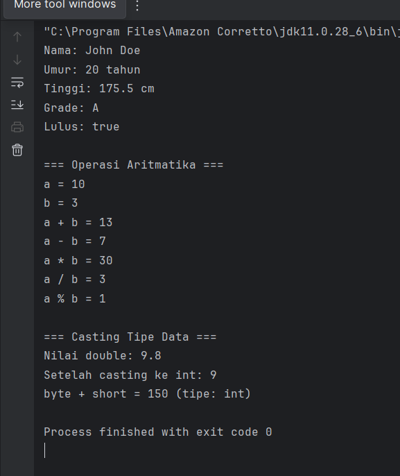
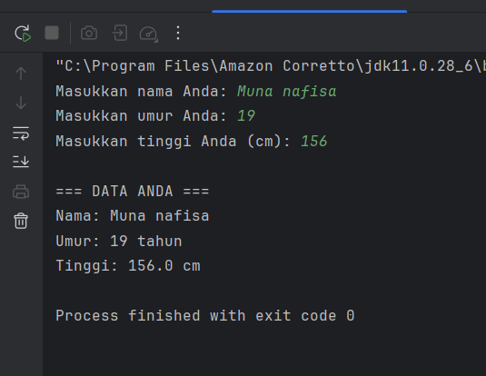
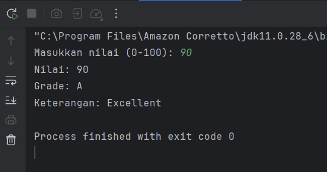
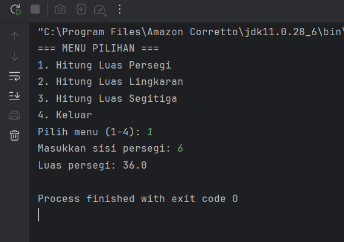
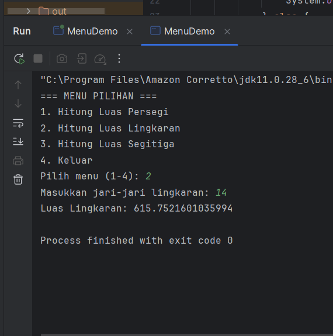
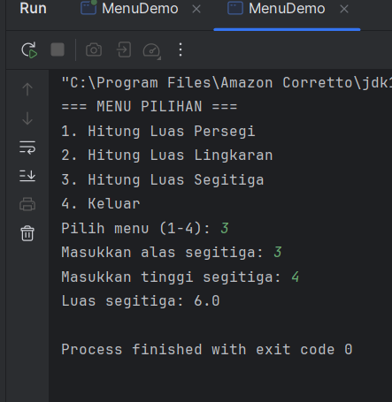
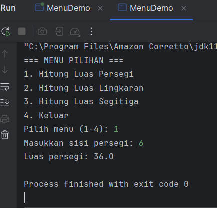
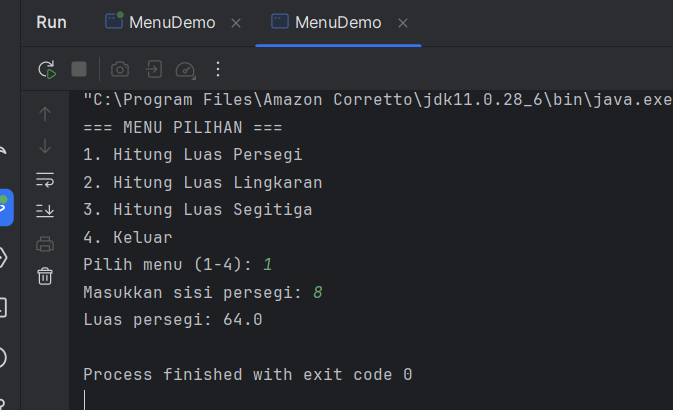

# Laporan Modul 2: Dasar Pemrograman Java
**Mata Kuliah:** Praktikum Pemrograman Berorientasi Objek   
**Nama:** [Muna Nafisa]  
**NIM:** [2024573010048]  
**Kelas:** [TI2A]  

## 1. Abstrak
Pemrograman Java merupakan salah satu fondasi penting dalam dunia teknologi informasi dan pengembangan perangkat lunak. Java dikenal sebagai bahasa pemrograman berorientasi objek yang sederhana,
aman, serta memiliki tingkat portabilitas tinggi. Dengan mengusung prinsip write once, run anywhere, Java memungkinkan kode program dijalankan di berbagai platform melalui perantara Java Virtual Machine (JVM).
Kajian mengenai dasar pemrograman Java meliputi pemahaman struktur program, variabel, tipe data, operator, percabangan, perulangan, hingga konsep objek dan kelas. Dengan menguasai dasar-dasar ini, pembelajar dapat membangun pondasi yang kuat untuk mengembangkan aplikasi lebih kompleks, baik pada bidang desktop, web, maupun mobile. Oleh karena itu, pemahaman terhadap dasar pemrograman Java menjadi hal esensial dalam proses pembelajaran ilmu komputer dan rekayasa perangkat lunak.
## 2. Praktikum
### Praktikum 1 - Variabel dan Tipe Data
#### Dasar Teori
Java memiliki dua kategori tipe data:

Tipe Data Primitif
byte: 8-bit signed integer (-128 to 127)
short: 16-bit signed integer (-32,768 to 32,767)
int: 32-bit signed integer (-2,147,483,648 to 2,147,483,647)
long: 64-bit signed integer
float: 32-bit IEEE 754 floating point
double: 64-bit IEEE 754 floating point
boolean: true atau false
char: 16-bit Unicode character
Tipe Data Reference
String, Array, Object, dll.
Aturan Penamaan Variabel
Dimulai dengan huruf, underscore (_), atau dollar sign ($)
Tidak boleh dimulai dengan angka
Case sensitive
Tidak boleh menggunakan keyword Java
Prasyarat
Buat sebuah package baru dengan nama modul_2 di dalam folder src

#### Langkah Praktikum
Langkah 1: Variabel dan tipe data

1. Buat file baru dengan nama VariabelDemo.java
2. Ketik kode berikut:

            package modul_2;
            public class VariableDemo {
         public static void main(String[] args) {
         // Deklarasi dan inisialisasi variabel
         int umur = 20;
          double tinggi = 175.5;
          char grade = 'A';
          boolean lulus = true;
         String nama = "John Doe";

         // Menampilkan nilai variabel
         System.out.println("Nama: " + nama);
         System.out.println("Umur: " + umur + " tahun");
         System.out.println("Tinggi: " + tinggi + " cm");
         System.out.println("Grade: " + grade);
         System.out.println("Lulus: " + lulus);

         int a = 10;
         int b = 3;

         System.out.println("\n=== Operasi Aritmatika ===");
         System.out.println("a = " + a);
         System.out.println("b = " + b);
         System.out.println("a + b = " + (a + b));
         System.out.println("a - b = " + (a - b));
         System.out.println("a * b = " + (a * b));
         System.out.println("a / b = " + (a / b));
         System.out.println("a % b = " + (a % b));

         System.out.println("\n=== Casting Tipe Data ===");
         double nilaiDouble = 9.8;
         int nilaiInt = (int) nilaiDouble;

         System.out.println("Nilai double: " + nilaiDouble);
         System.out.println("Setelah casting ke int: " + nilaiInt);

         // Automatic promotion
         byte byteVar = 50;
         short shortVar = 100;
         int hasil = byteVar + shortVar;
         System.out.println("byte + short = " + hasil + " (tipe: int)");
           }
         }

#### Screenshoot Hasil

#### Analisa dan Pembahasan
1. Deklarasi dan Inisialisasi Variabel
    int umur = 20;
    double tinggi = 175.5;
    char grade = 'A';
    boolean lulus = true;
    String nama = "John Doe";
    
Variabel digunakan untuk menyimpan data.
Tipe data berbeda dipilih sesuai kebutuhan:
int untuk bilangan bulat.
double untuk bilangan pecahan/desimal.
char untuk 1 karakter.
boolean untuk kondisi benar/salah.
String untuk teks.

Analisa: Program memperlihatkan penggunaan berbagai tipe data dasar di Java.

2. Output Variabel
   System.out.println("Nama: " + nama);
   System.out.println("Umur: " + umur + " tahun");
   System.out.println("Tinggi: " + tinggi + " cm");
   System.out.println("Grade: " + grade);
   System.out.println("Lulus: " + lulus);
Menggunakan concatenation (+) untuk menggabungkan teks dengan nilai variabel.
Output akan menampilkan informasi identitas sederhana.

Analisa: Menunjukkan bagaimana variabel bisa ditampilkan ke layar.

3. Operasi Aritmatika
   int a = 10;
   int b = 3;

System.out.println("a + b = " + (a + b));
System.out.println("a - b = " + (a - b));
System.out.println("a * b = " + (a * b));
System.out.println("a / b = " + (a / b));
System.out.println("a % b = " + (a % b));
Operator dasar: +, -, *, /, %.
Karena a dan b bertipe int, maka a / b menghasilkan bilangan bulat (10 / 3 = 3, bukan 3.33).
% menghasilkan sisa bagi (10 % 3 = 1).

Analisa: Bagian ini menjelaskan operasi matematika dasar di Java.
    
4. Casting Tipe Data
   double nilaiDouble = 9.8;
   int nilaiInt = (int) nilaiDouble;
(int) adalah type casting untuk mengubah double menjadi int.
Angka desimal 9.8 akan dibulatkan ke bawah menjadi 9.

Analisa: Menunjukkan konversi tipe data secara manual.

5. Automatic Type Promotion
   byte byteVar = 50;
   short shortVar = 100;
   int hasil = byteVar + shortVar;

Saat operasi aritmatika dilakukan pada tipe data kecil (byte dan short), hasil otomatis dipromosikan ke int.
Jadi hasilnya bertipe int walaupun operand-nya bukan int.
Analisa: Menjelaskan aturan promosi tipe data otomatis di Java.

## Pembahasan

Program ini berfungsi sebagai demo variabel, operasi aritmatika, casting, dan promotion di Java.
Variabel dan Tipe Data.
Program memperlihatkan bagaimana menyimpan berbagai macam data (angka, teks, logika).
Hal ini penting untuk memahami dasar pemrograman berorientasi objek.
Operasi Aritmatika
Menunjukkan cara kerja operator dasar.
Menekankan bahwa tipe data berpengaruh pada hasil operasi (int division membulatkan hasil).
Casting Tipe Data
Berguna ketika kita ingin mengubah tipe data tertentu agar sesuai dengan kebutuhan (misalnya dari double ke int).
Automatic Promotion
Java otomatis mengubah hasil operasi ke tipe data yang lebih besar untuk menghindari kehilangan data.
Ini membantu mencegah error saat perhitungan.

~Kesimpulan

Program ini adalah contoh dasar untuk memahami variabel, operator, dan konversi tipe data di Java.
Cocok sebagai latihan awal sebelum masuk ke konsep lebih lanjut seperti array, loop, atau OOP (Object-Oriented Programming).

### Praktikum 2 -  Input, Output dan Scanner
#### Dasar Teori
Untuk membaca input dari pengguna dalam Java, kita menggunakan class Scanner yang terdapat dalam package java.util. Scanner menyediakan berbagai method untuk membaca berbagai tipe data:

nextInt(): membaca integer
nextDouble(): membaca double
nextLine(): membaca String (termasuk spasi)
next(): membaca String (sampai spasi pertama)
nextBoolean(): membaca boolean

#### Langkah Praktikum
Langkah 1: Import dan Membuat Scanner

1. Buat file baru dengan nama InputOutputDemo.java
2. Ketik kode berikut:

         package modul_2;

         import java.util.Scanner;

         public class InputOutputDemo {
          public static void main(String[] args) {
         // Membuat objek Scanner
          Scanner input = new Scanner(System.in);

        // Membaca input string
        System.out.print("Masukkan nama Anda: ");
        String nama = input.nextLine();

        // Membaca input integer
        System.out.print("Masukkan umur Anda: ");
        int umur = input.nextInt();

        // Membaca input double
        System.out.print("Masukkan tinggi Anda (cm): ");
        double tinggi = input.nextDouble();

        // Menampilkan output
        System.out.println("\n=== DATA ANDA ===");
        System.out.println("Nama: " + nama);
        System.out.println("Umur: " + umur + " tahun");
        System.out.println("Tinggi: " + tinggi + " cm");

        // Menutup Scanner
        input.close();
             }
         }

#### Screenshoot Hasil

#### Analisa dan Pembahasan

### Praktikum 3 -  Struktur Control: Percabangan
#### Dasar Teori
Struktur kontrol percabangan digunakan untuk membuat keputusan dalam program. Java menyediakan beberapa statement percabangan:

If Statement
if (kondisi) {
// kode yang dijalankan jika kondisi true
}
If-Else Statement
if (kondisi) {
// kode jika kondisi true
} else {
// kode jika kondisi false
}
If-Else If-Else Statement
if (kondisi1) {
// kode jika kondisi1 true
} else if (kondisi2) {
// kode jika kondisi2 true
} else {
// kode jika semua kondisi false
}
Switch Statement

switch (variabel) {
case nilai1:
// kode
break;
case nilai2:
// kode
break;
default:
// kode default
}

#### Langkah Praktikum
1. Buat file baru dengan nama GradeDemo.java
2. Implementasikan kode berikut:
  
         package modul_2;

         import java.util.Scanner;
         public class GradeDemo {
         public static void main(String[] args) {
          Scanner input = new Scanner(System.in);

            System.out.print("Masukkan nilai (0-100): ");
            int nilai = input.nextInt();

            char grade;
            String keterangan;

            // Menggunakan if-else if-else
            if (nilai > 85) {
                grade = 'A';
                keterangan = "Excellent";
            } else if (nilai > 75) {
                grade = 'B';
                keterangan = "Good";
            } else if (nilai > 65) {
                grade = 'C';
                keterangan = "Fair";
            } else if (nilai > 55) {
                grade = 'D';
                keterangan = "Poor";
            } else {
                grade = 'E';
                keterangan = "Fail";
            }

            System.out.println("Nilai: " + nilai);
            System.out.println("Grade: " + grade);
            System.out.println("Keterangan: " + keterangan);

            input.close();
        }

Langkah 2: Program Menu dengan Switch

1. Buat file baru dengan nama MenuDemo.java
   2. Implementasikan kode berikut:
   
            package modul_2;

            import java.util.Scanner;

            public class MenuDemo {
            public static void main(String[] args) {
            Scanner input = new Scanner(System.in);

            System.out.println("=== MENU PILIHAN ===");
            System.out.println("1. Hitung Luas Persegi");
            System.out.println("2. Hitung Luas Lingkaran");
            System.out.println("3. Hitung Luas Segitiga");
            System.out.println("4. Keluar");

            System.out.print("Pilih menu (1-4): ");
            int pilihan = input.nextInt();
    
             switch (pilihan) {
            case 1:
                System.out.print("Masukkan sisi persegi: ");
                double sisi = input.nextDouble();
                double luasPersegi = sisi * sisi;
                System.out.println("Luas persegi: " + luasPersegi);
                break;

            case 2:
                System.out.print("Masukkan jari-jari lingkaran: ");
                double jariJari = input.nextDouble();
                double luasLingkaran = Math.PI * jariJari * jariJari;
                System.out.println("Luas Lingkaran: " + luasLingkaran);
                break;

            case 3:
                System.out.print("Masukkan alas segitiga: ");
                double alas = input.nextDouble();
                System.out.print("Masukkan tinggi segitiga: ");
                double tinggi = input.nextDouble();
                double luasSegitiga = 0.5 * alas * tinggi;
                System.out.println("Luas segitiga: " + luasSegitiga);
                break;

            case 4:
                System.out.println("Terima kasih!");
                break;

            default:
                System.out.println("Pilihan tidak valid!");
             }

            input.close();
            }
   
Langkah 3: Program Nested If

1. Buat file baru dengan nama NestedIfDemo.java
2. Implementasikan program untuk menentukan kategori usia:
   
         package modul_2;

          import java.util.Scanner;

       public class NestedIfDemo {
           public static void main(String[] args) {
       Scanner input = new Scanner(System.in);

         System.out.print("Masukkan umur: ");
         int umur = input.nextInt();

          if (umur > 0) {
         if (umur < 2) {
             System.out.println("Kategori: Bayi");
         } else if (umur < 5) {
             System.out.println("Kategori: Balita");
         } else if (umur < 12) {
             System.out.println("Kategori: Anak-anak");
         } else if (umur < 19) {
             System.out.println("Kategori: Remaja");
         } else if (umur < 59) {
             System.out.println("Kategori: Dewasa");
         } else {
             System.out.println("Kategori: Lansia");
         }
         } else {
         System.out.println("Umur tidak valid!");
         }

         input.close();
          }

#### Screenshoot Hasil
langkah1:

langkah2

langkah3:

#### Analisa dan Pembahasan

### Praktikum 4 - Struktur Control: Perulangan
#### Dasar Teori
Perulangan (loop) digunakan untuk mengulang eksekusi kode tertentu. Java menyediakan tiga jenis perulangan:

For Loop
for (inisialisasi; kondisi; increment/decrement) {
// kode yang diulang
}
While Loop
while (kondisi) {
// kode yang diulang
}
Do-While Loop

do {
// kode yang diulang
} while (kondisi);

#### Langkah Praktikum
Langkah 1: Perulangan For

1. Buat file baru dengan nama ForLoopDemo.java
2. Implementasikan berbagai contoh for loop:

         package modul_2;

         public class ForLoopDemo {
         public static void main(String[] args) {
         // Contoh 1
         System.out.println("=== Angka 1-10 ===");
         for (int i = 1; i <= 10; i++) {
         System.out.print(i + " ");
          }
         System.out.println();

        // Contoh 2
        System.out.println("\n=== Angka Genap 2-20 ===");
        for (int i = 2; i <= 20; i += 2) {
            System.out.print(i + " ");
        }
        System.out.println();

        // Contoh 3
        System.out.println("\n=== Countdown ===");
        for (int i = 10; i >= 1; i--) {
            System.out.print(i + " ");
        }
        System.out.println("Start!");

        // Contoh 4
        System.out.println("\n=== Tabel Perkalian 5 ===");
        for (int i = 1; i <= 10; i++) {
            System.out.println("5 x " + i + " = " + (5 * i));
        }
         }

Langkah 2: Perulangan While dan Do-While

1. Buat file baru dengan nama WhileLoopDemo.java
2. Implementasikan contoh while dan do-while:
   
         package modul_2;

             import java.util.Scanner;

         public class WhileLoopDemo {
         public static void main(String[] args) {
         Scanner input = new Scanner(System.in);

         // Contoh While Loop
         System.out.println("=== While Loop - Tebak Angka ===");
         int angkaRahasia = 7;
         int tebakan = 0;

          while (tebakan != angkaRahasia) {
         System.out.print("Tebak angka (1-10): ");
         tebakan = input.nextInt();

         if (tebakan < angkaRahasia) {
             System.out.println("Terlalu kecil!");
         } else if (tebakan > angkaRahasia) {
             System.out.println("Terlalu besar!");
         } else {
             System.out.println("Benar! Angka rahasianya adalah " + angkaRahasia);
         }
         }

         // Contoh Do-While Loop
         System.out.println("\n=== Do-While Loop - Menu ===");
         int pilihan;
       do {
         System.out.println("1. Tampilkan pesan");
         System.out.println("2. Hitung faktorial");
         System.out.println("3. Keluar");
         System.out.print("Pilih menu: ");
         pilihan = input.nextInt();

         switch (pilihan) {
             case 1:
                 System.out.println("Hello, World!");
                 break;
             case 2:
                 System.out.print("Masukkan angka: ");
                 int n = input.nextInt();
                 long faktorial = 1;
                 for (int i = 1; i <= n; i++) {
                     faktorial *= i;
                 }
                 System.out.println("Faktorial " + n + " = " + faktorial);
                 break;
             case 3:
                 System.out.println("Terima kasih!");
                 break;
             default:
                 System.out.println("Pilihan tidak valid!");
         }
         } while (pilihan != 3);

         input.close();
         }

Langkah 3: Nested Loop (Perulangan Bersarang)

1. Buat file baru dengan nama NestedLoopDemo.java
2. Implementasikan contoh nested loop:
      
         package modul_2;

        public class NestedLoop {
        public static void main(String[] args) {
        // Contoh 1: Pola Bintang
        System.out.println("=== Pola Bintang Segitiga ===");
        for (int i = 1; i <= 5; i++) {
        for (int j = 1; j <= i; j++) {
        System.out.print("* ");
        }
        System.out.println();
        }

        // Contoh 2: Tabel Perkalian
        System.out.println("\n=== Tabel Perkalian 1-5 ===");
        for (int i = 1; i <= 5; i++) {
            for (int j = 1; j <= 5; j++) {
                System.out.printf("%3d ", (i * j));
            }
            System.out.println();
        }

        // Contoh 3: Pola Angka
        System.out.println("\n=== Pola Angka ===");
        for (int i = 1; i <= 4; i++) {
            for (int j = 1; j <= i; j++) {
                System.out.print(j + " ");
            }
            System.out.println();
        }
         }

#### Screenshoot Hasil
langkah1:

langkah2:

langkah3:

#### Analisa dan Pembahasan

---

## 3. Kesimpulan
Java merupakan bahasa pemrograman berorientasi objek yang memiliki keunggulan dalam hal portabilitas, keamanan, dan kemudahan penggunaan. Dengan konsep write once, run anywhere, Java memungkinkan program dijalankan pada berbagai platform tanpa harus melakukan banyak penyesuaian kode.
Pemahaman dasar pemrograman Java, seperti struktur program, variabel, tipe data, percabangan, perulangan, serta konsep kelas dan objek, menjadi fondasi penting bagi mahasiswa maupun pengembang perangkat lunak. Melalui penguasaan dasar tersebut, 
pembelajar dapat mengembangkan keterampilan dalam membangun aplikasi yang lebih kompleks dan siap menghadapi tantangan dalam dunia teknologi informasi.

## 5. Referensi
Cantumkan sumber yang Anda baca (buku, artikel, dokumentasi) — minimal 2 sumber. Gunakan format sederhana (judul — URL).

