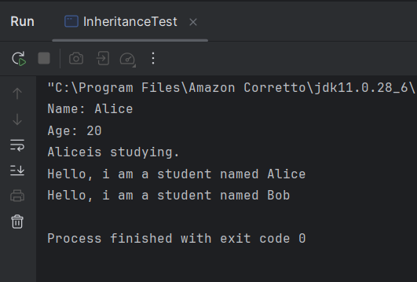
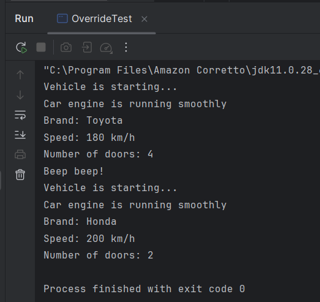
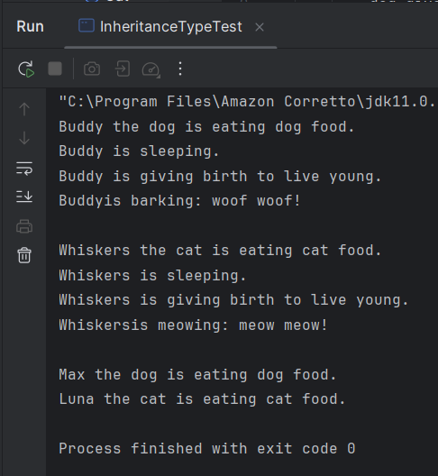
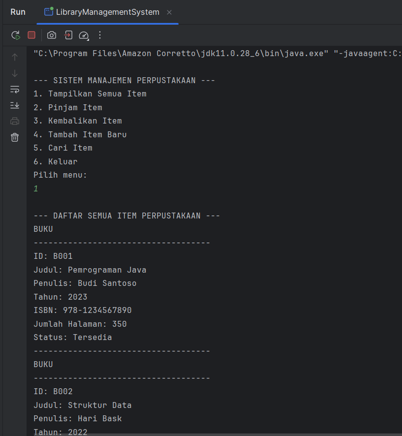
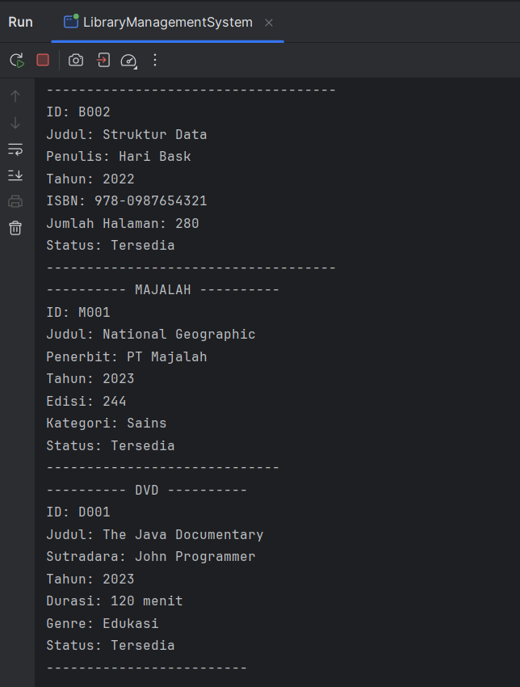
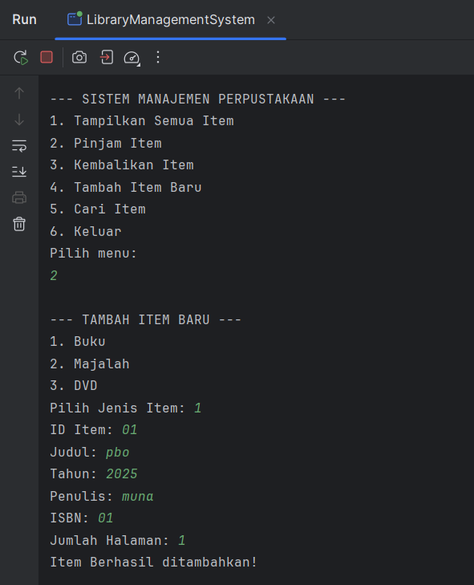
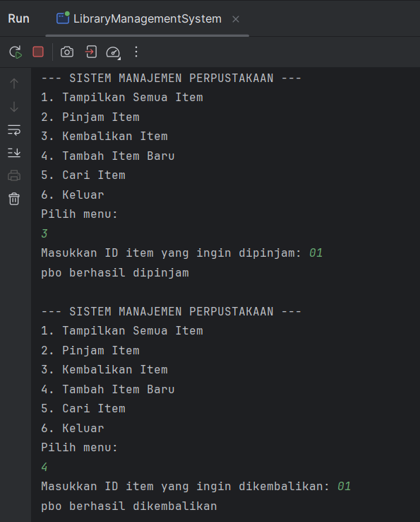
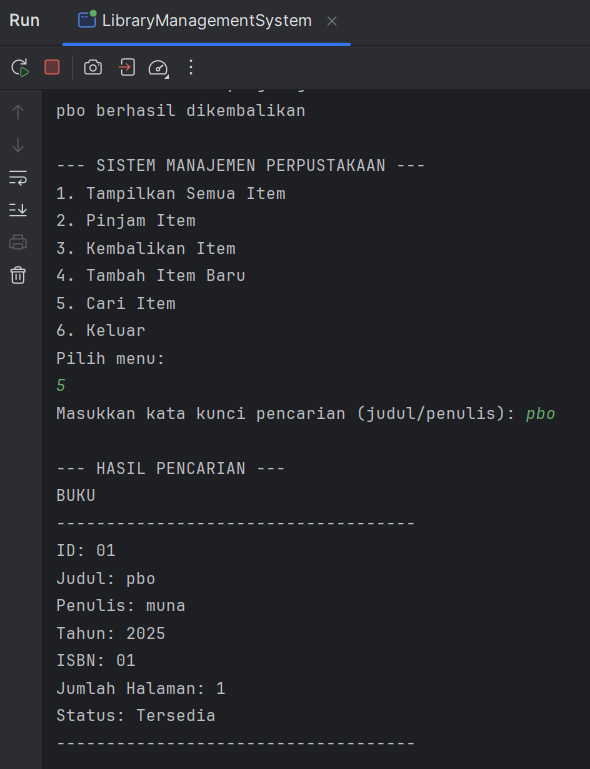
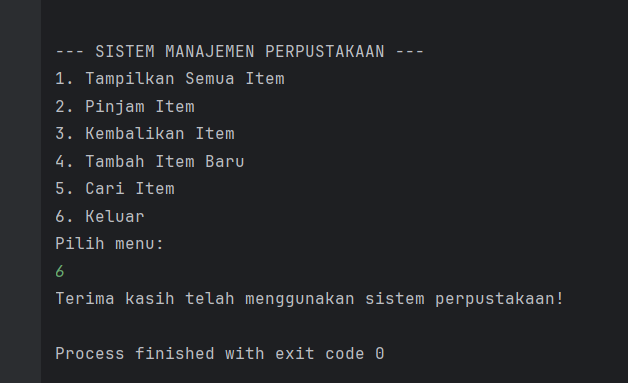

# Laporan Modul 6: Inheritance
**Mata Kuliah:** Praktikum Pemrograman Berorientasi Objek   
**Nama:** [Muna Nafisa]  
**NIM:** [2024573010048]  
**Kelas:** [TI2A]

## 1. Abstrak
Inheritance (Pewarisan) adalah salah satu prinsip fundamental dalam Object-Oriented Programming (OOP) yang memungkinkan sebuah class (subclass/child class) mewarisi sifat dan perilaku dari class lain (superclass/parent class). Dengan inheritance, kita dapat menghindari duplikasi kode dan meningkatkan reusability.
#### Langkah Praktikum

- Praktikum 1: Memahami Single Inheritance

1. Buat sebuah package baru di dalam package modul_6 dengan nama praktikum_1
2. Buat class Person sebagai superclass,lalu isikan kode berikut:

        package modul_6.modul_8.praktikum1;
        
        public class Person {
        protected String name;
        protected int age;
        
            public Person(String name, int age) {
                this.name = name;
                this.age = age;
            }
        
            public void displayInfo() {
                System.out.println("Name: " + name);
                System.out.println("Age: " + age);
            }
        
            public void greet() {
                System.out.println("Hello, I am a person");
            }
        }

3. Buat class Student sebagai subclass yang mewarisi Person,lalu isikan kode berikut:

        package modul_6.modul_8.praktikum1;
        
        public class Student extends Person {
        private String StudentId;
        
            public Student(String name, int age, String StudentId) {
                super(name, age);
                this.StudentId = StudentId;
            }
        
            public void study() {
                System.out.println(name + "is studying.");
            }
        
            @Override
            public void greet() {
                System.out.println("Hello, i am a student named " + name);
            }
        }

4. Buat class InheritanceTest untuk testing, lalu isikan kode berikut:

        package modul_6.modul_8.praktikum1;
        
        public class InheritanceTest {
        public static void main(String [] args) {
        Student student = new Student("Alice", 20, "S12345");
        
                //memanggil method dari superclass
                student.displayInfo();
        
                //memanggil method dari subclass
                student.study();
        
                //memanggil overriden meyhod
                student.greet();
        
                //polymorphism: student sebagai person
                Person person = new Student("Bob",22, "S7890");
                person.greet();
            }
        }
5. Jalankan program

- Praktikum 2: Method Overriding dan Kata Kunci super
 
1. Buat sebuah package baru di dalam package modul_6 dengan nama praktikum_2
2. Buat class Vehicle sebagai superclass, lalu isikan kode berikut:

        package modul_6.modul_8.praktikum2;
        
        public class Vehicle {
        protected String brand;
        protected int speed;
        
            public Vehicle(String brand, int speed) {
                this.brand = brand;
                this.speed = speed;
            }
        
            public void start() {
                System.out.println("Vehicle is starting...");
            }
        
            public void displayInfo() {
                System.out.println("Brand: " + brand);
                System.out.println("Speed: " + speed + " km/h");
            }
        }
3. Buat class Car sebagai subclass yang mewarisi Vehicle, lalu isikan kode berikut:

        package modul_6.modul_8.praktikum2;
        
            public class Car extends Vehicle {
                private int numberOfDoors;
        
                public Car(String brand, int speed, int numberOfDoors) {
                    super(brand, speed); // Memanggil constructor superclass
                    this.numberOfDoors = numberOfDoors;
                }
        
                @Override
                public void start() {
                    super.start(); // Memanggil method start dari superclass
                    System.out.println("Car engine is running smoothly");
                }
        
                @Override
                public void displayInfo() {
                    super.displayInfo(); // Memanggil method displayInfo dari superclass
                    System.out.println("Number of doors: " + numberOfDoors);
                }
        
                public void honk() {
                    System.out.println("Beep beep!");
                }
            }
4. Buat class OverrideTest untuk testing, lalu isikan kode berikut:

        package modul_6.modul_8.praktikum2;
        
        public class OverrideTest {
        public static void main(String[] args) {
        Car car = new Car("Toyota", 180, 4);
        
                // Memanggil overridden method
                car.start();
                car.displayInfo();
                car.honk();
        
                // Demonstrasi polymorphism
                Vehicle vehicle = new Car("Honda", 200, 2);
                vehicle.start();       // Memanggil method yang di-override
                vehicle.displayInfo(); // Memanggil method yang di-override
            }
        }
5.  Jalankan program

- Praktikum 3: Multilevel dan Hierarchical Inheritance

1. Buat sebuah package baru di dalam package modul_6 dengan nama praktikum_3
2. Buat class Animal sebagai superclass,lalu isikan kode berikut:

        package modul_6.praktikum3;
        
        public class Animal {
        protected String name;
        
            public Animal(String name) {
                this.name = name;
            }
        
            public void eat() {
                System.out.println(name + " is eating. ");
            }
        
            public void sleep() {
                System.out.println(name + " is sleeping. ");
            }
        }
3. Buat class Mammal yang mewarisi Animal (multilevel inheritance),lalu isikan kode berikut:

        package modul_6.praktikum3;
        
        public class Mammal extends  Animal {
        protected  String furColor;
        
            public Mammal(String name, String furColor)
            {
                super(name);
                this. furColor = furColor;
            }
        
            public void giveBirth() {
                System.out.println(name + " is giving birth to live young. ");
            }
        }
4. Buat class Dog yang mewarisi Mammal (multilevel inheritance), lalu isikan kode berikut:

        package modul_6.praktikum3;
        
        public class Dog extends Mammal {
        private String breed;
        
            public Dog(String name, String furColor, String breed) {
                super(name, furColor);
                this.breed = breed;
            }
        
            public void  bark() {
                System.out.println(name + "is barking: woof woof!");
            }
        
            @Override
            public void eat() {
                System.out.println(name + " the dog is eating dog food. ");
            }
        }
5. Buat class Cat yang mewarisi Mammal (hierarchical inheritance), lalu isikan kode berikut:

        package modul_6.praktikum3;
        
        public class Cat extends  Mammal{
        private  boolean isIndoor;
        
            public  Cat(String name, String furColor, boolean isIndoor) {
                super(name, furColor);
                this.isIndoor = isIndoor;
            }
        
            public void  meow() {
                System.out.println(name + "is meowing: meow meow!");
            }
        
            @Override
            public void eat() {
                System.out.println(name + " the cat is eating cat food.");
            }
        }
6. Buat class InheritanceTypeTest untuk testing, lalu isikan kode berikut:

        package modul_6.praktikum3;
        
        public class InheritanceTypeTest {
        public static void main(String[] args) {
        // Multilevel inheritance test
        Dog dog = new Dog("Buddy", "Brown", "Golden Retriever");
        dog.eat();
        dog.sleep();
        dog.giveBirth();
        dog.bark();
        
                System.out.println();
        
                Cat cat = new Cat("Whiskers", "White", true);
                cat.eat();
                cat.sleep();
                cat.giveBirth();
                cat.meow();
        
                System.out.println();
        
                Animal[] animals = {
                        new Dog("Max", "Black", "Labrador"),
                        new Cat("Luna", "Gray", false)
                };
        
                for (Animal animal : animals) {
                    animal.eat();
                }
            }
        }
7. Jalankan program

- Praktikum 4: Sistem Manajemen Perpustakaan Sederhana

1. Buat sebuah package baru di dalam package modul_6 dengan nama praktikum_4
2. Buat class LibraryItem sebagai superclass, lalu isikan kode berikut:

            package modul_6.praktikum4;
            
            public abstract class LibraryItem {
            protected String itemId;
            protected String title;
            protected int year;
            protected boolean isAvailable;
            
                public LibraryItem(String itemId, String title, int year) {
                    this.itemId = itemId;
                    this.title = title;
                    this.year = year;
                    this.isAvailable = true;
                }
            
                // Getter methods
                public String getItemId() { return itemId; }
                public String getTitle() { return title; }
                public int getYear() { return year; }
                public boolean isAvailable() { return isAvailable; }
            
                // Setter methods
                public void setAvailable(boolean available) { isAvailable = available; }
            
                // Abstract method yang harus diimplementasikan subclass
                public abstract void displayInfo();
            
                // Concrete method yang bisa digunakan semua subclass
                public void borrowItem() {
                    if (isAvailable) {
                        isAvailable = false;
                        System.out.println(title + " berhasil dipinjam");
                    } else {
                        System.out.println(title + " sedang tidak tersedia");
                    }
                }
            
                public void returnItem() {
                    isAvailable = true;
                    System.out.println(title + " berhasil dikembalikan");
                }
            }
3. Buat class Book yang mewarisi LibraryItem, lalu isikan kode berikut:

        package modul_6.praktikum4;
        
        public class Book extends LibraryItem {
        private String author;
        private String isbn;
        private int numberOfPages;
        
            public Book(String itemID, String title, int year, String author, String isbn, int numberOfPages) {
                super(itemID, title, year);
                this.author = author;
                this.isbn = isbn;
                this.numberOfPages = numberOfPages;
            }
        
            @Override
            public void displayInfo() {
                System.out.println("BUKU");
                System.out.println("------------------------------------");
                System.out.println("ID: " + itemId);
                System.out.println("Judul: " + title);
                System.out.println("Penulis: " + author);
                System.out.println("Tahun: " + year);
                System.out.println("ISBN: " + isbn);
                System.out.println("Jumlah Halaman: " + numberOfPages);
                System.out.println("Status: " + (isAvailable ? "Tersedia" : "Dipinjam"));
                System.out.println("------------------------------------");
            }
        
            // Method khusus Book
            public void readSample() {
                System.out.println("Membaca sample dari buku: " +title);
        }
        }
4. Buat class Magazine yang mewarisi LibraryItem, lalu isikan kode berikut:

        package modul_6.praktikum4;
        
        public class Magazine extends LibraryItem {
        private String publisher;
        private int issueNumber;
        private String category;
        
            public Magazine(String itemID, String title, int year, String publisher, int issueNumber, String category) {
                super(itemID, title, year);
                this.publisher = publisher;
                this.issueNumber = issueNumber;
                this.category = category;
            }
        
            @Override
            public void displayInfo() {
                System.out.println("---------- MAJALAH ----------");
                System.out.println("ID: " + itemId);
                System.out.println("Judul: " + title);
                System.out.println("Penerbit: " + publisher);
                System.out.println("Tahun: " + year);
                System.out.println("Edisi: " + issueNumber);
                System.out.println("Kategori: " + category);
                System.out.println("Status: " + (isAvailable ? "Tersedia" : "Dipinjam"));
                System.out.println("-----------------------------");
            }
        
            // Method khusus Magazine
            public void browseArticles() {
                System.out.println("Menelusuri artikel dalam majalah: " +title);
            }
        }
5. Buat class DVD yang mewarisi LibraryItem, lalu isikan kode berikut:

        package modul_6.praktikum4;
        
        public class DVD extends LibraryItem {
        private String director;
        private int duration; // dalam menit
        private String genre;
        
            public DVD(String itemId, String title, int year, String director, int duration, String genre) {
                super(itemId, title, year);
                this.director = director;
                this.duration = duration;
                this.genre = genre;
            }
        
            @Override
            public void displayInfo() {
                System.out.println("---------- DVD ----------");
                System.out.println("ID: " + itemId);
                System.out.println("Judul: " + title);
                System.out.println("Sutradara: " + director);
                System.out.println("Tahun: " + year);
                System.out.println("Durasi: " + duration + " menit");
                System.out.println("Genre: " + genre);
                System.out.println("Status: " + (isAvailable ? "Tersedia" : "Dipinjam"));
                System.out.println("-------------------------");
            }
        
            // Method khusus DVD
            public void playTrailer() {
                System.out.println("Memutar trailer DVD: " + title);
            }
        }
6. Buat class LibraryManagementSystem sebagai main class, lalu isikan kode berikut:

        package modul_6.praktikum4;
        
        import java.util.ArrayList;
        import java.util.Scanner;
        
        public class LibraryManagementSystem {
        private static ArrayList<LibraryItem> libraryItems = new ArrayList<>();
        private static Scanner scanner = new Scanner(System.in);
        
            public static void main(String[] args) {
                initializeSampleData();
        
                while (true) {
                    displayMenu();
                    int choice = scanner.nextInt();
                    scanner.nextLine(); // consume newline
        
                    switch (choice) {
                        case 1:
                            displayAllItems();
                            break;
                        case 2:
                            addItem();
                            break;
                        case 3:
                            borrowItem();
                            break;
                        case 4:
                            returnItem();
                            break;
                        case 5:
                            searchItem();
                            break;
                        case 6:
                            System.out.println("Terima kasih telah menggunakan sistem perpustakaan!");
                            return;
                        default:
                            System.out.println("Pilihan menu tidak valid!");
                    }
                }
            }
        
            private static void displayMenu() {
                System.out.println("\n--- SISTEM MANAJEMEN PERPUSTAKAAN ---");
                System.out.println("1. Tampilkan Semua Item");
                System.out.println("2. Pinjam Item");
                System.out.println("3. Kembalikan Item");
                System.out.println("4. Tambah Item Baru");
                System.out.println("5. Cari Item");
                System.out.println("6. Keluar");
                System.out.println("Pilih menu: ");
            }
        
            // Perhatikan: Method initializeSampleData() ada di gambar pertama,
            // tetapi pemanggilan method addItem() dan returnItem() di main() sepertinya ada kesalahan nomor di gambar.
            // Berdasarkan menu yang ditampilkan:
            // 2. Pinjam Item -> borrowItem()
            // 3. Kembalikan Item -> returnItem()
            // 4. Tambah Item Baru -> addItem()
            //
            // Saya akan menyalin implementasi di gambar sesuai urutan (meski urutan di main() tidak sesuai dengan displayMenu):
            // Kasus 2: displayAllItems() -> seharusnya borrowItem()
            // Kasus 3: borrowItem() -> seharusnya returnItem()
            // Kasus 4: returnItem() -> seharusnya addItem()
            // Kasus 5: searchItem() -> sudah benar
        
            private static void initializeSampleData() {
                libraryItems.add(new Book("B001", "Pemrograman Java", 2023, "Budi Santoso", "978-1234567890", 350));
                libraryItems.add(new Book("B002", "Struktur Data", 2022, "Hari Bask", "978-0987654321", 280));
                libraryItems.add(new Magazine("M001", "National Geographic", 2023, "PT Majalah", 244, "Sains"));
                libraryItems.add(new DVD("D001", "The Java Documentary", 2023, "John Programmer", 120, "Edukasi"));
            }
        
            private static void displayAllItems() {
                System.out.println("\n--- DAFTAR SEMUA ITEM PERPUSTAKAAN ---");
                for (LibraryItem item : libraryItems) {
                    item.displayInfo();
                }
            }
        
            private static void borrowItem() {
                System.out.print("Masukkan ID item yang ingin dipinjam: ");
                String itemId = scanner.nextLine();
        
                for (LibraryItem item : libraryItems) {
                    if (item.getItemId().equalsIgnoreCase(itemId)) {
                        item.borrowItem();
                        return;
                    }
                }
        
                System.out.println("Item dengan ID " + itemId + " tidak ditemukan!");
            }
        
            private static void returnItem() {
                System.out.print("Masukkan ID item yang ingin dikembalikan: ");
                String itemId = scanner.nextLine();
        
                for (LibraryItem item : libraryItems) {
                    if (item.getItemId().equalsIgnoreCase(itemId)) {
                        item.returnItem();
                        return;
                    }
                }
        
                System.out.println("Item dengan ID " + itemId + " tidak ditemukan!");
            }
        
            // --- Bagian dari Gambar Kedua ---
        
            private static void addItem() {
                System.out.println("\n--- TAMBAH ITEM BARU ---");
                System.out.println("1. Buku");
                System.out.println("2. Majalah");
                System.out.println("3. DVD");
                System.out.print("Pilih Jenis Item: ");
                int type = scanner.nextInt();
                scanner.nextLine(); // consume newline
        
                System.out.print("ID Item: ");
                String itemId = scanner.nextLine();
                System.out.print("Judul: ");
                String title = scanner.nextLine();
                System.out.print("Tahun: ");
                int year = scanner.nextInt();
                scanner.nextLine(); // consume newline
        
                switch (type) {
                    case 1:
                        System.out.print("Penulis: ");
                        String author = scanner.nextLine();
                        System.out.print("ISBN: ");
                        String isbn = scanner.nextLine();
                        System.out.print("Jumlah Halaman: ");
                        int pages = scanner.nextInt();
                        scanner.nextLine();
                        libraryItems.add(new Book(itemId, title, year, author, isbn, pages));
                        break;
                    case 2:
                        System.out.print("Penerbit: ");
                        String publisher = scanner.nextLine();
                        System.out.print("Edisi: ");
                        int issue = scanner.nextInt();
                        scanner.nextLine();
                        System.out.print("Kategori: ");
                        String category = scanner.nextLine();
                        libraryItems.add(new Magazine(itemId, title, year, publisher, issue, category));
                        break;
                    case 3:
                        System.out.print("Sutradara: ");
                        String director = scanner.nextLine();
                        System.out.print("Durasi (menit): ");
                        int duration = scanner.nextInt();
                        scanner.nextLine();
                        System.out.print("Genre: ");
                        String genre = scanner.nextLine();
                        libraryItems.add(new DVD(itemId, title, year, director, duration, genre));
                        break;
                    default:
                        System.out.println("Jenis Item tidak valid!");
                        return;
                }
        
                System.out.println("Item Berhasil ditambahkan!");
            }
        
            private static void searchItem() {
                System.out.print("Masukkan kata kunci pencarian (judul/penulis): ");
                String keyword = scanner.nextLine().toLowerCase();
        
                System.out.println("\n--- HASIL PENCARIAN ---");
                boolean found = false;
        
                for (LibraryItem item : libraryItems) {
                    String titleLower = item.getTitle().toLowerCase();
        
                                String searchString = titleLower;
                    if (item instanceof Book) {
                                        if (titleLower.contains(keyword)) {
                            item.displayInfo();
                            found = true;
                        }
                    } else {
                        if (titleLower.contains(keyword)) {
                            item.displayInfo();
                            found = true;
                        }
                    }
                }
        
                if (!found) {
                    System.out.println("Tidak ada item yang sesuai dengan pencarian.");
                }
            }
        }
7. Jalankan program

#### Screenshoot Hasil

#### Analisa dan Pembahasan

**PRAKTIKUM 1**

**1.Class PERSON**

1. class person

Kode tersebut mendefinisikan sebuah class Person yang merepresentasikan objek “orang”.

    public class Person {

- public ⇒ bisa diakses dari mana saja.

- class Person ⇒ nama kelas adalah Person.

2. Atribut / Properti

        protected String name;
        protected int age;

- name (tipe String) = menyimpan nama orang

- age (tipe int) = menyimpan umur orang

- protected ⇒ bisa diakses oleh:

    - kelas itu sendiri,

    - subclass (pewaris),

  - kelas dalam paket yang sama.

Ini menunjukkan class ini disiapkan untuk pewarisan (inheritance).

3. Konstruktor (Person)

        public Person(String name, int age) {
        this.name = name;
        this.age = age;
        }

- Konstruktor dipanggil ketika membuat objek Person.

- this.name = name; ⇒ menyimpan parameter ke dalam atribut kelas.

- Fungsinya menginisialisasi objek baru.

Contoh pemanggilan:

      Person p = new Person("John", 25);

4. Metode displayInfo()

        public void displayInfo() {
        System.out.println("Name: " + name);
        System.out.println("Age: " + age);
        }

- Menampilkan nilai properti name dan age.

- name dan age bisa diakses langsung karena ada di dalam class.

5. Metode greet()

        public void greet() {
        System.out.println("Hello, I am a person.");
        }

- Metode sederhana yang menampilkan salam.

- Metode ini dapat dioverride oleh subclass (misal Student, Teacher, dll).

**2. class STUDENT**

1. Struktur Kelas

        public class Student extends Person {
        private String studentId;

- Student mewarisi (extends) kelas Person.

- Artinya, Student otomatis memiliki atribut dan method yang ada dalam Person (misalnya name, age, dan mungkin greet()).

- studentId dibuat private, menerapkan konsep encapsulation.

2. Constructor Student

        public Student(String name, int age, String studentId) {
        super(name, age); // Memanggil constructor superclass
        this.studentId = studentId;
        }

Berfungsi untuk:

- Memanggil constructor milik Person menggunakan super(name, age).

- Menginisialisasi atribut lokal studentId.

Ini menunjukkan penggunaan super() untuk mengakses konstruktor kelas induk.

3. Method study()

        public void study() {
        System.out.println(name + " is studying.");
        }

Catatan:

- Method ini menggunakan variabel name langsung.

- PERINGATAN: ini hanya valid jika di kelas Person, variabel name memiliki modifier protected atau public.
Jika name itu private, maka ini akan error.

4. Method Overriding: greet()

        @Override
        public void greet() {
        System.out.println("Hello, I am a student named " + name);
        }

- Method ini meng-override method greet() dari kelas Person.

- Menunjukkan polymorphism.

- Output-nya berbeda dari greet() versi Person.

**3. CLASS INHERITANCETEST**

1. Membuat objek Student

        Student student = new Student("Alice", 20, "S12345");

- Membuat objek Student dengan name, age, dan studentId.

- Konstruktor Student otomatis memanggil super(name, age) dari kelas Person.

2. Memanggil method dari superclass

        student.displayInfo();

- Method displayInfo() berasal dari kelas Person.

- Karena Student adalah turunan Person, ia dapat memanggil method ini.

Output kemungkinan seperti:

    Name: Alice
    Age: 20

3. Memanggil method subclass

        student.study();

- Dipanggil dari kelas Student.

Contoh output:

    Alice is studying.

4. Memanggil method yang dioverride

        student.greet();

- Walaupun Person punya greet(), yang dipanggil adalah versi Student karena overriding.

Contoh output:
         
    Hello, I am a student named Alice

5. Polymorphism

        Person person = new Student("Bob", 22, "S67890");
        person.greet();

Penjelasan:

- Objek adalah Student, tapi referensinya Person.

- Ini disebut polymorphism (lebih tepatnya: upcasting).

- Method yang dipanggil tetap milik Student, karena Java memakai dynamic binding.

Output:

    Hello, I am a student named Bob

**PRAKTIKUM 2**

**1. CLASS VEHICLE**

1. Deklarasi Kelas & Atribut

        public class Vehicle {
        protected String brand;
        protected int speed;

- Atribut brand dan speed menggunakan protected:

Dapat diakses oleh:

✔ class ini sendiri

✔ subclass (kelas turunan)

✔ package yang sama

- Cocok dipakai saat ingin membiarkan subclass mengakses atribut langsung.

Ini menunjukkan encapsulation level menengah (tidak private, tidak public).

2. Constructor

        public Vehicle(String brand, int speed) {
        this.brand = brand;
        this.speed = speed;
        }

Fungsi:

- Menginisialisasi atribut ketika objek Vehicle dibuat.

- Memudahkan subclass untuk memanggilnya via super(brand, speed).

Jika nanti ada subclass, wajib memanggil konstruktor ini.

3. Method start()

        public void start() {
        System.out.println("Vehicle is starting...");
        }

- Method sederhana yang menampilkan pesan.

- Cocok untuk overriding di subclass.

Contohnya, subclass bisa meng-override seperti:

    @Override
    public void start() {
    System.out.println("Car is starting with ignition...");
    }

Menunjukkan potensi polymorphism.

4. Method displayInfo()

        public void displayInfo() {
        System.out.println("Brand: " + brand);
        System.out.println("Speed: " + speed + " km/h");
        }

- Method yang menampilkan informasi kendaraan.

- Dapat dipanggil oleh subclass tanpa perlu override.

- Bisa digunakan untuk menunjukkan penggunaan super.displayInfo() pada subclass.

**2. CLASS CAR**

1. Deklarasi Kelas & Atribut

        public class Car extends Vehicle {
        private int numberOfDoors;
        }

- Car mewarisi atribut brand dan speed dari Vehicle.

- Menambah atribut baru:

      private int numberOfDoors;

→ menerapkan encapsulation (private).

2. Constructor

        public Car(String brand, int speed, int numberOfDoors) {
        super(brand, speed);
        this.numberOfDoors = numberOfDoors;
        }

- super(brand, speed) memanggil constructor milik Vehicle.

- Inisialisasi atribut baru (numberOfDoors) dilakukan di constructor subclass.

Ini menunjukkan constructor chaining (pemanggilan constructor parent).

3. Method Overriding: start()

        @Override
        public void start() {
        super.start();
        System.out.println("Car engine is running smoothly");
        }

- start() di Vehicle diganti (overridden), tetapi tetap memanggil versi superclass menggunakan super.start().

Output menjadi dua baris:

    Vehicle is starting...
    Car engine is running smoothly

Ini adalah contoh polymorphism dan perluasan behavior superclass

4. Method Overriding: displayInfo()

        @Override
        public void displayInfo() {
        super.displayInfo();
        System.out.println("Number of doors: " + numberOfDoors);
        }

- Tetap memanggil method Vehicle.displayInfo().

- Menambahkan informasi spesifik untuk mobil.

Contoh output:

    Brand: Toyota
    Speed: 120 km/h
    Number of doors: 4

5. Method Baru honk()

        public void honk() {
        System.out.println("Beep beep!");
        }
- Ini adalah fungsi baru yang tidak ada di superclass.

- Menunjukkan penambahan perilaku khusus pada subclass.

**3. CLASS OverrideTest**

1. Membuat objek Car

        Car car = new Car("Toyota", 180, 4);
Objek Car dengan:

- brand = Toyota

- speed = 180 km/h

- numberOfDoors = 4

Karena Car extends Vehicle, ia punya semua method dan atribut dari Vehicle.

2. Memanggil method overridden

        car.start();
        car.displayInfo();
        car.honk();

- car.start();

Memanggil start() milik Car, yang isinya:

        super.start();
        System.out.println("Car engine is running smoothly");

Output:

    Vehicle is starting...
    Car engine is running smoothly

- car.displayInfo();

Menggunakan override:

    super.displayInfo();
    System.out.println("Number of doors: " + numberOfDoors);

Output:

    Brand: Toyota
    Speed: 180 km/h
    Number of doors: 4

- car.honk();

Method khusus Car:

    Beep beep!

3. Demonstrasi Polymorphism

        Vehicle vehicle = new Car("Honda", 200, 2);

- objek sebenarnya = Car

- tipe referensi = Vehicle (superclass)

Ini disebut upcasting, dan tujuan umum polymorphism.

Memanggil method:

    vehicle.start();
    vehicle.displayInfo();

Walaupun tipe referensi adalah Vehicle, method yang dipanggil adalah versi Car, karena Java menggunakan dynamic dispatch.

Output:
    
    Vehicle is starting...
    Car engine is running smoothly
    
    Brand: Honda
    Speed: 200 km/h
    Number of doors: 2

- Method yang hanya dimiliki Car (misal: honk()) tidak bisa dipanggil:

        vehicle.honk();  // ERROR

- Karena referensi-nya adalah Vehicle.

**Praktikum 3**

**1. CLASS Animal**

1. Nama Class

        public class Animal

Class ini bernama Animal, bersifat public sehingga dapat diakses dari mana saja.

2. Atribut / Variable

        protected String name;

- Modifier protected artinya atribut name dapat diakses oleh:

    - Class ini sendiri

    - Class turunan (subclass)

    - Class dalam satu paket yang sama

- Menyimpan nama hewan.

3. Constructor

        public Animal(String name) {
        this.name = name;
        }

Constructor dipanggil setiap kali objek Animal dibuat.

- this.name mengacu ke atribut class.

- name adalah parameter dari constructor.

- Tujuannya adalah memberi nilai awal (inisialisasi) ke atribut name.

4. Method eat()

        public void eat() {
        System.out.println(name + " is eating.");
        }

Method ini menampilkan teks bahwa hewan sedang makan.

Contoh output:

    Kucing is eating.

5. Method sleep()

        public void sleep() {
        System.out.println(name + " is sleeping.");
        }
Method ini menampilkan bahwa hewan sedang tidur.

**2. CLASS Mammal**

1. Hubungan Pewarisan

        public class Mammal extends Animal

- Mammal adalah subclass dari Animal.

- Mewarisi name, eat(), dan sleep() dari Animal.

2. Atribut Baru

          protected String furColor;

- Semua mamalia memiliki warna bulu ⇒ atribut ini cocok untuk Mamalia.

- protected agar bisa diakses oleh Dog dan Cat.

3. Constructor Mammal

        super(name);
        this.furColor = furColor;

- super(name) memanggil constructor Animal untuk mengisi atribut name.

- this.furColor = furColor menyimpan warna bulu.

- Proses konstruksi terjadi bertahap:

    1. Constructor Animal dijalankan

    2. Constructor Mammal dijalankan
 

4. Method Baru giveBirth()

        public void giveBirth() {
        System.out.println(name + " is giving birth to live young.");
        }
Semua mamalia melahirkan, sehingga method ini ada di Mammal, bukan Animal.

**3. CLASS Dog**

1. Pewarisan Bertingkat (Multilevel)

        Dog → Mammal → Animal

Dog mewarisi:

Dari Animal:

✔ name

✔ eat() (tapi di-override)

✔ sleep()

Dari Mammal:

✔ furColor

✔ giveBirth()

Dog menambah:

- breed

- bark()

- override eat()

2. Atribut Baru

          private String breed;

- Ras anjing (Labrador, Golden Retriever, dll.)

- private agar benar-benar encapsulated → hanya bisa diakses dalam class Dog.

3.  Constructor Dog

        super(name, furColor);
        this.breed = breed;

- super(...) memanggil constructor Mammal

- Mammal memanggil constructor Animal

- Konstruktor Dog mengisi breed

4. Method Baru bark()

        System.out.println(name + " is barking: Woof woof!");

Perilaku unik anjing.

5. Method Override eat()

        @Override
        public void eat() {
        System.out.println(name + " the dog is eating dog food.");
        }

- Mengganti perilaku makan bawaan dari Animal.

- Menjadi lebih spesifik untuk anjing.

**4. CLASS Cat**

1. Pewarisan

        Cat → Mammal → Animal

2. Atribut Baru

         private boolean isIndoor;

- Menyimpan apakah kucing ini tinggal di dalam rumah atau tidak.

- private sebagai encapsulation.

3.  Constructor Cat

- Memanggil constructor Mammal menggunakan super(name, furColor)

- Mengisi atribut isIndoor

4.  Method Baru meow()

- Kucing memiliki suara khas, sehingga method ini hanya milik Cat.

5. Override Method eat()

- Perilaku makan kucing beda dari Dog atau Animal.

**5. CLASS InheritanceTypeTest**

1. Multilevel Inheritance Test

Dog melalui 3 tingkat pewarisan:

Animal → Mammal → Dog

Method yang dipanggil:

eat()     dari Dog (override)

sleep()   dari Animal

giveBirth()     dari Mammal

bark()          dari Dog

2. Hierarchical Inheritance Test

Kita membuat objek Cat.

**Method:**

eat()

sleep()	 

giveBirth()	

meow()

**Asal**

override Cat

Animal

Mammal

Cat

- Dog dan Cat sama-sama turunan Mammal (hierarchical).

3. Polymorphism Test

          Animal[] animals = {...}

Walaupun tipe array adalah Animal, yang dipanggil adalah method eat() sesuai jenis objek sebenarnya.

- Jika objeknya Dog → Dog.eat()

- Jika objeknya Cat → Cat.eat()

Ini disebut runtime polymorphism / dynamic dispatch.

**Praktikum 4**

**1. Class LibraryItem**

1. Fungsi Utama

Menjadi parent class untuk semua item perpustakaan (Buku, Majalah, DVD).
Class ini abstract, jadi tidak bisa dibuat objek langsung.

2. Atribut

        protected String itemId;
        protected String title;
        protected int year;
        protected boolean isAvailable;

- protected → bisa diakses subclass (Book, Magazine, DVD)

- isAvailable → status ketersediaan untuk dipinjam

3. Constructor

        public LibraryItem(String itemId, String title, int year) {
        this.itemId = itemId;
        this.title = title;
        this.year = year;
        this.isAvailable = true;
        }

Setiap item baru otomatis tersedia (true).

**Getter & Setter**

- Memberikan akses membaca & mengubah data

- isAvailable() & setAvailable() mengontrol status pinjam

4. Method Abstract

          public abstract void displayInfo();
Wajib dioverride oleh semua subclass.

Digunakan untuk menampilkan info item sesuai jenisnya.

5. Method konkret (dipakai semua subclass)

borrowItem()

Meminjam item:

- Jika tersedia → dipinjam

- Jika tidak → tampilkan notifikasi tidak tersedia

returnItem()

Mengembalikan item:

- Status jadi true lagi

Kesimpulan untuk class ini:
Menjadi kerangka dasar semua item perpustakaan.
Subclass mewarisi struktur & method umum.

**2. Class Book (Subclass dari LibraryItem)**

1. Atribut Khusus

        private String author;
           private String isbn;
           private int numberOfPages;
Menambah informasi yang hanya dimiliki oleh buku.

2. Constructor Book

        public Book(String itemId, String title, int year,
        String author, String isbn, int numberOfPages) {
        super(itemId, title, year);
        this.author = author;
        this.isbn = isbn;
        this.numberOfPages = numberOfPages;
        }
- super() memanggil constructor parent

- Menetapkan data khusus buku

**Override displayInfo()**

Menampilkan semua info buku:

- ID

- Judul

- Penulis

- ISBN

- Jumlah halaman

- Status (Tersedia / Dipinjam)

3. Method khusus Book

        public void readSample() {
        System.out.println("Membaca sample dari buku: " + title);
        }

Fungsi tambahan yang hanya dimiliki objek Book.

**3. Class Magazine (Subclass dari LibraryItem)**

1. Atribut Khusus

        private String publisher;
        private int issueNumber;
        private String category;

2. Constructor

        super(itemId, title, year);
        this.publisher = publisher;
        this.issueNumber = issueNumber;
        this.category = category;
Sama seperti Book, tetapi dengan atribut berbeda.

**Override displayInfo()**

Menampilkan format khusus majalah:

- Penerbit

- Edisi

- Kategori

3. Method khusus Magazine

        public void browseArticles() {
        System.out.println("Menelusuri artikel dalam majalah: " + title);
        }

Majalah memiliki informasi dan fungsi unik yang tidak dimiliki item lain

**4. Class DVD (Subclass dari LibraryItem)**

1. Atribut Khusus

        private String director;
        private int duration;
        private String genre;

2. Constructor

- Sama seperti lainnya, memanggil super() dan meng-set atribut DVD.

3. Override displayInfo()

Menampilkan info DVD:

- Sutradara

- Durasi

- Genre

- Tahun

- Status pinjam

4. Method khusus DVD

        public void playTrailer() {
        System.out.println("Memutar trailer DVD: " + title);
        }
Fungsi khusus untuk DVD.

Kesimpulan:

DVD memiliki fitur pemutaran trailer yang tidak dimiliki item lain.

**5. CLASS LibraryManagementSystem**

1. Struktur Kelas

Dalam kode ini terlihat ada class utama:

    public class LibraryManagementSystem

dan ada tiga turunan item yang disebut di dalam kode:

- Book

- Magazine

- DVD

Semua item disimpan dalam:

    private static ArrayList<LibraryItem> libraryItems = new ArrayList<>();
Artinya semua item mewarisi class LibraryItem.

2. Alur Program Utama (main method)

Di dalam main():

- Memanggil initializeSampleData() untuk mengisi data awal.

- Menampilkan menu pilihan (loop selama true):

  - 1 → Menampilkan semua item

  - 2 → Pinjam item

  - 3 → Kembalikan item

  - 4 → Tambah item baru

  - 5 → Cari item

  - 0 → Keluar

Switch-case sudah benar dan rapi.

3. Fungsi-Fungsi Utama

**DisplayMenu()**

Menampilkan menu pilihan untuk user.

**initializeSampleData()**

Menambahkan item contoh ke ArrayList:

- Menambah beberapa Book

- Menambah Magazine

- Menambah DVD

Semua dilakukan dengan:

    libraryItems.add(new Book("ID", "Judul", "Penulis"...));
- Ini menunjukkan pemanfaatan inheritance dengan baik.

**displayAllItems()**

Menampilkan semua item yang ada:

    for (LibraryItem item : libraryItems) {
    item.displayInfo();
    }
- Polymorphism: setiap item akan memanggil displayInfo() sesuai jenis objeknya (Book/Magazine/DVD).

**borrowItem()**

Meminjam item berdasarkan ID:

    if (item.getItemID().equalsIgnoreCase(itemID)) {
    item.borrowItem();
    }

- Menggunakan pencarian linear.

- Menggunakan polymorphism karena borrowItem() bisa di-override.

**returnItem()**

Mirip seperti borrowItem, tetapi mengeksekusi:

    item.returnItem();

**addNewItem()**

User diminta memilih jenis item:

- 1 = Book

- 2 = Magazine

- 3 = DVD

Setiap pilihan memiliki input berbeda, sesuai atribut masing-masing kelas.

Contoh untuk Book:

    new Book(itemID, title, author, year, isbn, pages)
- Penanganan input memakai scanner dengan tepat.

**searchItem()**

User mencari berdasarkan keyword yang dicek terhadap:

    item.getTitle().toLowerCase().contains(keyword)

Jika ketemu → tampilkan item.

Jika tidak → tampilkan pesan.

## 3. Kesimpulan

konsep pewarisan merupakan salah satu pilar penting dalam OOP yang memungkinkan sebuah kelas baru (subclass) mewarisi atribut serta metode dari kelas lain (superclass). Dengan adanya inheritance, proses pengembangan program menjadi lebih efisien karena kode yang bersifat umum dapat ditempatkan pada superclass, sementara subclass hanya perlu menambahkan atau mengubah bagian tertentu sesuai kebutuhannya.

Melalui implementasi inheritance pada praktikum ini, dapat terlihat bahwa pemrograman menjadi lebih terstruktur, mudah dikelola, dan mampu mengurangi terjadinya duplikasi kode. Selain itu, inheritance juga membuka peluang penerapan konsep OOP lain seperti polymorphism dan method overriding, yang membuat program lebih fleksibel dan mudah dikembangkan. Secara keseluruhan, penggunaan inheritance terbukti meningkatkan kualitas desain perangkat lunak serta mempermudah proses pemeliharaan dan pengembangan fitur di masa mendatang.
## 4. Referensi
https://hackmd.io/@mohdrzu/r1Cxc-p0eg