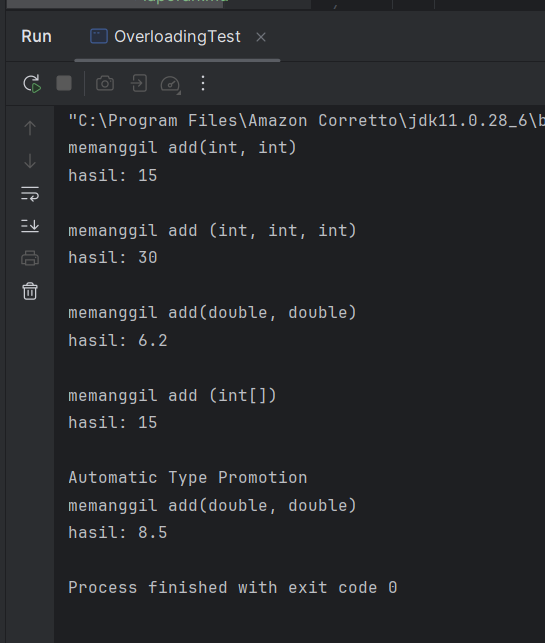
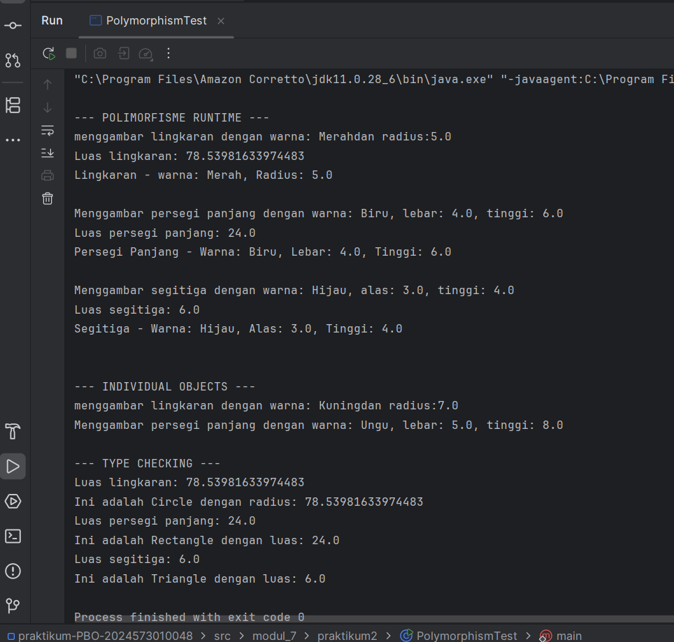

# Laporan Modul 7: Polymorphism
**Mata Kuliah:** Praktikum Pemrograman Berorientasi Objek   
**Nama:** [Muna Nafisa]  
**NIM:** [2024573010048]  
**Kelas:** [TI2A]

## 1. Abstrak
Dalam konteks pemrograman OOP (Object Oriented Programming), istilah polymorphism sering digunakan karena berkaitan erat dengan salah satu pilar seperti class, object, method, atau inheritance. Polymorphism adalah banyak bentuk atau bermacam-macam. Dalam istilah pemrograman, polymorphism adalah sebuah konsep di mana sebuah interface tunggal digunakan pada entitas yang berbeda-beda. Umumnya, penggunaan suatu simbol tunggal berfungsi untuk mewakili beberapa jenis tipe entitas.

Polymorphism adalah konsep pemrograman yang berorientasi pada objek yang mengacu pada kemampuan variabel, fungsi atau objek untuk mengambil beberapa bentuk. Polymorphism adalah penggunaan salah satu item seperti fungsi, atribut, atau interface pada berbagai jenis objek yang berbeda dalam bahasa pemrograman. Dalam bahasa pemrograman yang menunjukkan polimorfisme, objek kelas miliki hierarki yang sama yang diwariskan dari kelas induk yang sama, mungkin memiliki fungsi dengan nama yang sama, tetapi dengan perilaku berbeda.
#### Langkah Praktikum

**Praktikum 1: Memahami Method Overloading (Compile-time Polymorphism)**

1. Buat sebuah package baru di dalam package modul_7 dengan nama praktikum_1
2. Buat class Calculator dengan method overloading:

        package modul_7.praktikum1;
        
        public class Calculator {
        
            //method untuk menjumlahkan dua integer
            public int add(int a, int b) {
                System.out.println("memanggil add(int, int)");
                return a + b;
            }
        
            //overload method untuk menjumlahkan tigs integer
            public int add(int a, int b, int c) {
                System.out.println("memanggil add (int, int, int)");
                return a + b + c;
            }
        
            //overload method untuk menjumlahkan dua double
            public double add(double a, double b) {
                System.out.println("memanggil add(double, double)");
                return a + b;
            }
        
            //overload method untuk menjalankan array integer
            public int add(int[] numbers) {
                System.out.println("memanggil add (int[])");
                int sum = 0;
                for (int num: numbers) {
                    sum += num;
                }
                return sum;
            }
        
            //overload method untuk concatenate strings
            public  String add( String a, String b) {
                System.out.println("memanggil add(String, String)");
                return a + b;
            }
        }

3. Buat class OverloadingTest untuk testing:

        package modul_7.praktikum1;
        
        public class OverloadingTest {
        public static void main(String[] args) {
        Calculator calc = new Calculator();
        
                //test berbagai versi method add
                System.out.println("hasil: " + calc.add(5, 10));
                System.out.println();
        
                System.out.println("hasil: " + calc.add(5, 10, 15));
                System.out.println();
        
                System.out.println("hasil: " + calc.add(3.5, 2.7));
                System.out.println();
        
                int[] numbers = {1, 2, 3, 4, 5};
                System.out.println("hasil: " + calc.add(numbers));
                System.out.println();
        
                //demonstrasi automatic type promotion
                System.out.println("Automatic Type Promotion");
                System.out.println("hasil: " +calc.add(5, 3.5)); //int + double
            }
        }

4. Jalankan program

**Praktikum 2: Memahami Method Overriding (Runtime Polymorphism)**

1. Buat sebuah package baru di dalam package modul_7 dengan nama praktikum_2
2. Buat class Shape sebagai superclass:

        package modul_7.praktikum2;
        
        public class Shape {
        protected String color;
        
            public  Shape(String color) {
                this. color = color;
            }
        
            public void draw() {
                System.out.println("menggambar shape dengan warna: " + color);
            }
        
            public double calculateArea() {
                System.out.println("menghitung luas shape umum");
                return 0.0;
            }
        
            public void displayInfo() {
                System.out.println("shape - warna: " +color);
            }
        }
3. Buat class Circle yang mewarisi Shape:

        package modul_7.praktikum2;
        
        public class Circle extends Shape{
        private double radius;
        
            public Circle(String color, double radius) {
                super(color);
                this.radius = radius;
            }
        
            @Override
            public void  draw() {
                System.out.println("menggambar lingkaran dengan warna: " +color + "dan radius:" + radius);
            }
        
            @Override
            public double calculateArea() {
                double area = Math.PI * radius * radius;
                System.out.println("Luas lingkaran: " + area);
                return area;
            }
        
            @Override
            public void displayInfo(){
                System.out.println("Lingkaran - warna: " + color + ", Radius: " + radius);
            }
        }
4. Buat class Rectangle yang mewarisi Shape:

        package modul_7.praktikum2;
        
        public class Rectangle extends Shape {
        private double width;
        private double height;
        
            public Rectangle(String color, double width, double height) {
                super(color);
                this.width = width;
                this.height = height;
            }
        
            @Override
            public void draw() {
                System.out.println("Menggambar persegi panjang dengan warna: " + color +
                        ", lebar: " + width + ", tinggi: " + height);
            }
        
            @Override
            public double calculateArea() {
                double area = width * height;
                System.out.println("Luas persegi panjang: " + area);
                return area;
            }
        
            @Override
            public void displayInfo() {
                System.out.println("Persegi Panjang - Warna: " + color +
                        ", Lebar: " + width + ", Tinggi: " + height);
            }
        }

5. Buat class Triangle yang mewarisi Shape:

        package modul_7.praktikum2;
        
        public class Triangle extends Shape {
        private double base;
        private double height;
        
            public Triangle(String color, double base, double height) {
                super(color);
                this.base = base;
                this.height = height;
            }
        
            @Override
            public void draw() {
                System.out.println("Menggambar segitiga dengan warna: " + color +
                        ", alas: " + base + ", tinggi: " + height);
            }
        
            @Override
            public double calculateArea() {
                double area = 0.5 * base * height;
                System.out.println("Luas segitiga: " + area);
                return area;
            }
        
            @Override
            public void displayInfo() {
                System.out.println("Segitiga - Warna: " + color +
                        ", Alas: " + base + ", Tinggi: " + height);
            }
        }

6. Buat class PolymorphismTest untuk testing:

        package modul_7.praktikum2;
        
        public class PolymorphismTest {
        public static void main(String[] args) {
        // Demonstrasi runtime polymorphism
        Shape[] shapes = new Shape[3];
        shapes[0] = new Circle("Merah", 5.0);
        shapes[1] = new Rectangle("Biru", 4.0, 6.0);
        shapes[2] = new Triangle("Hijau", 3.0, 4.0);
        
                System.out.println("\n--- POLIMORFISME RUNTIME ---");
                for (Shape shape : shapes) {
                    shape.draw();              // Akan memanggil method sesuai objek sebenarnya
                    shape.calculateArea();     // Akan memanggil method sesuai objek sebenarnya
                    shape.displayInfo();       // Akan memanggil method sesuai objek sebenarnya
                    System.out.println();
                }
        
                // Demonstrasi dengan individual objects
                System.out.println("\n--- INDIVIDUAL OBJECTS ---");
                Shape shape1 = new Circle("Kuning", 7.0);
                Shape shape2 = new Rectangle("Ungu", 5.0, 8.0);
        
                shape1.draw(); // Memanggil Circle's draw()
                shape2.draw(); // Memanggil Rectangle's draw()
        
                // Type casting dan instanceof
                System.out.println("\n--- TYPE CHECKING ---");
                for (Shape shape : shapes) {
                    if (shape instanceof Circle) {
                        Circle circle = (Circle) shape;
                        System.out.println("Ini adalah Circle dengan radius: " + circle.calculateArea());
                    } else if (shape instanceof Rectangle) {
                        Rectangle rectangle = (Rectangle) shape;
                        System.out.println("Ini adalah Rectangle dengan luas: " + rectangle.calculateArea());
                    } else if (shape instanceof Triangle) {
                        Triangle triangle = (Triangle) shape;
                        System.out.println("Ini adalah Triangle dengan luas: " + triangle.calculateArea());
                    }
                }
            }
        }

7. Jalankan program

#### Screenshoot Hasil

#### Analisa dan Pembahasan

**PRAKTIKUM 1**

**1.Class Calculator**

1. Method: add(int a, int b)

        public int add(int a, int b) {
        System.out.println("memanggil add(int, int)");
        return a + b;
        }

- Fungsi:Menjumlahkan dua bilangan integer.
- Ciri:Parameter: (int, int), Return type: int

2. Method: add(int a, int b, int c)

        public int add(int a, int b, int c) {
        System.out.println("memanggil add (int, int, int)");
        return a + b + c;
        }
- Fungsi: Menjumlahkan tiga bilangan integer.
- Perbedaan dari method pertama: Tambah 1 parameter, sehingga compiler Java tetap bisa bedakan method mana yang dipanggil.

3. Method: add(double a, double b)

        public double add(double a, double b) {
        System.out.println("memanggil add(double, double)");
        return a + b;
        }
- Fungsi : Menjumlahkan dua bilangan pecahan (double).
- Masuk overloading karena:Parameter tipe berbeda → (double, double), Return type beda tidak cukup, tapi di sini parameternya juga beda → valid overloading.

4. Method: add(int[] numbers)
 ers) {
        System.out.println("memanggil add (int[])");
        int sum = 0;
        for (int num: numbers) {
        sum += num;
        }
        return sum;
        }
- Fungsi : Menjumlahkan seluruh angka di dalam sebuah array integer.
- Ciri : Parameternya berupa array → berbeda dari yang lain , Cocok untuk input fleksibel (jumlah elemen tidak tetap)
- Cara kerja : Looping for-each menjumlahkan semua elemen array.

5. Method: add(String a, String b):

        public String add(String a, String b) {
        System.out.println("memanggil add(String, String)");
        return a + b;
        }

- Fungsi : Melakukan concatenate (menggabungkan) dua string.

    Contoh: add("Hello", "World") → "HelloWorld"

- disebut "add" : Karena konsep “penjumlahan” di string berarti penggabungan.

Konsep OOP yang digunakan

- Class ini mendemonstrasikan Method Overloading, yaitu:

- “Beberapa method dengan nama sama tetapi parameter berbeda.”

- Dengan syarat:
- Method harus berbeda pada jumlah parameter, tipe parameter, atau urutan parameter.

Return type boleh berbeda, tapi tidak cukup untuk overloading.

**Contoh Output Pemanggilan Method**

Jika kode diuji seperti ini:

    Calculator c = new Calculator();
    c.add(5, 10);
    c.add(5, 10, 15);
    c.add(2.5, 3.7);
    c.add(new int[]{1,2,3,4});
    c.add("Hello ", "World");

Muncul output:

    memanggil add(int, int)
    memanggil add (int, int, int)
    memanggil add(double, double)
    memanggil add (int[])
    memanggil add(String, String)

**2. CLASS OverloadingTest**

        Calculator calc = new Calculator();

Membuat objek Calculator yang berisi banyak method add (overloading).

1. calc.add(5, 10)

- Memanggil versi: add(int, int)

- Output:

        memanggil add(int, int)
2. calc.add(5, 10, 15)

- Memanggil versi: add(int, int, int)

- Output:

      memanggil add (int, int, int)

3. calc.add(3.5, 2.7)

- Memanggil versi: add(double, double)

- Output:

      memanggil add(double, double)

4. calc.add(numbers)

- numbers adalah array {1,2,3,4,5}

- Memanggil versi: add(int[])

- Output:

      memanggil add (int[])

5. Automatic Type Promotion
   
          calc.add(5, 3.5);

- Argumen:

    - 5 → int
    
    - 3.5 → double

- Java otomatis mempromosikan 5 → 5.0 (double)

- Sehingga yang dipanggil adalah add(double, double)

- Output:

      memanggil add(double, double)
Kesimpulan:
- Program ini mengetes method overloading di class Calculator.

- Java memilih method berdasarkan tipe dan jumlah parameter.

- Pada kasus (int, double), Java mengubah int → double (automatic type promotion) dan memanggil versi add(double, double).

**3. Class Circle**

1. Atribut (radius)

        private double radius;

- Menyimpan nilai jari-jari lingkaran.

- private → hanya bisa diakses di dalam class Circle saja.

2. Constructor

        public Circle(String color, double radius) {
        super(color);
        this.radius = radius;
        }
  
- Fungsi: Menginisialisasi color melalui super(color) → memanggil constructor class induk (Shape).

- Mengisi nilai radius untuk object Circle.

- Kenapa pakai super(): Karena atribut color dimiliki oleh class Shape, bukan Circle.

3. Override Method draw()

        @Override
        public void draw() {
        System.out.println("menggambar lingkaran dengan warna: " + color + "dan radius:" + radius);
        }
   
- Fungsi:Menampilkan proses menggambar lingkaran.

- Method ini mengoverride (menimpa) method draw() dari parent class Shape.

4. Override Method calculateArea()

        @Override
        public double calculateArea() {
        double area = Math.PI * radius * radius;
        System.out.println("Luas lingkaran: " + area);
        return area;
        }

- Fungsi: Menghitung luas lingkaran dengan rumus:
π × r²

- Mencetak luasnya.

- Mengembalikan nilai area.

- Kenapa override: Karena setiap bentuk (Shape) punya cara menghitung luas yang berbeda.

5. Override Method displayInfo()

        @Override
        public void displayInfo() {
        System.out.println("Lingkaran - warna: " + color + ", Radius: " + radius);
        }

- Fungsi:

- Menampilkan informasi lengkap object lingkaran: warna + radius.

- Ini juga menimpa method displayInfo() dari kelas Shape.

**4. CLASS Rectangle**

1. Atribut width dan height

        private double width;
        private double height;

- width = lebar

- height = tinggi

- private → hanya bisa diakses dari dalam class Rectangle.

2. Constructor

        public Rectangle(String color, double width, double height) {
        super(color);
        this.width = width;
        this.height = height;
        }

- Fungsi: Menginisialisasi warna melalui constructor parent (super(color)).

- Mengisi nilai lebar & tinggi pada object Rectangle.

- Kenapa pakai super(color): Karena atribut color dimiliki class induk Shape, bukan Rectangle.

3. Override Method draw()

        @Override
        public void draw() {
        System.out.println("Menggambar persegi panjang dengan warna: " + color +
        ", lebar: " + width + ", tinggi: " + height);
        }

- Fungsi: Menampilkan proses menggambar persegi panjang.

- Meng-override method draw() milik Shape.

- Catatan: Menampilkan semua properti: color, width, height.

4. Override calculateArea()

        @Override
        public double calculateArea() {
        double area = width * height;
        System.out.println("Luas persegi panjang: " + area);
        return area;
        }

- Fungsi: Menghitung luas persegi panjang: width × height.

- Mencetak hasilnya.

- Mengembalikan nilai area.

- Kenapa override: Karena setiap bentuk (Shape) punya cara sendiri menghitung luas.

5. Override displayInfo()

        @Override
        public void displayInfo() {
        System.out.println("Persegi Panjang - Warna: " + color +
        ", Lebar: " + width + ", Tinggi: " + height);
        }
- Fungsi:

- Menampilkan info lengkap persegi panjang.

- Meng-override method info dari Shape.

**5. CLASS Shape**

1. Atribut

        protected String color;

- color menyimpan warna suatu bentuk.

- Modifier protected berarti: 

  - Bisa diakses di class ini

  - Bisa diakses oleh subclass (misal: Circle, Rectangle)

  - Tidak dapat diakses langsung dari luar package + luar class

- Alasan pakai protected: supaya subclass bisa langsung gunakan warna.

2. Constructor

        public Shape(String color) {
        this.color = color;
        }

- Fungsi:

    - Menginisialisasi nilai warna ketika membuat object Shape atau subclass-nya.

    - Dipanggil oleh subclass menggunakan super(color).

3. Method draw()

        public void draw() {
        System.out.println("menggambar shape dengan warna: " + color);
        }

- Fungsi:

    - Menyediakan implementasi dasar untuk menggambar shape.

    - Subclass akan override method ini untuk menampilkan gambar spesifik (lingkaran, persegi panjang, dll).

4. Method calculateArea()

        public double calculateArea() {
        System.out.println("menghitung luas shape umum");
        return 0.0;
        }

- Fungsi:

    - Memberi perhitungan luas default, tapi sebenarnya tidak berguna untuk bentuk nyata.

    - Subclass wajib override untuk menghitung luas sesuai rumus masing-masing.

- Contoh override:

    - Lingkaran → πr²

    - Persegi panjang → width × height

5. Method displayInfo()

        public void displayInfo() {
        System.out.println("shape - warna: " + color);
        }

- Fungsi:

    - Menampilkan informasi dasar shape.

    - Subclass akan override untuk menampilkan data tambahan (misal radius atau width/height).

**6. CLASS Triangle**

1. Deklarasi Class dan Pewarisan

        public class Triangle extends Shape {

- Triangle adalah class anak (subclass) dari Shape.

- Menggunakan keyword extends → berarti mewarisi properti & method dari Shape.

- Class Shape kemungkinan memiliki atribut seperti color dan method abstract seperti draw(), calculateArea(), dan displayInfo().

2. Property/Attribute Khusus Class Triangle

        private double base;
        private double height;

- base → menyimpan nilai alas segitiga.

- height → menyimpan nilai tinggi segitiga.

- private → hanya bisa diakses di dalam class ini (enkapsulasi).

3. Constructor

        public Triangle(String color, double base, double height) {
        super(color);
        this.base = base;
        this.height = height;
        }

- Constructor dipanggil saat objek Triangle dibuat.

- super(color) memanggil constructor dari class Shape untuk mengisi atribut color yang diwarisi.

- this.base = base → mengisi atribut alas.

- this.height = height → mengisi atribut tinggi.

4. Override Method draw()

        @Override
        public void draw() {
        System.out.println("Menggambar segitiga dengan warna: " + color +
        ", alas: " + base + ", tinggi: " + height);
        }

- @Override → menandakan bahwa method ini menimpa method yang sama di class Shape.

- Method draw() digunakan untuk menunjukkan proses menggambar segitiga.

- Mengakses variabel color dari class induk (berarti color memiliki akses minimal protected di class Shape).

5. Override Method calculateArea()

        @Override
        public double calculateArea() {
        double area = 0.5 * base * height;
        System.out.println("Luas segitiga: " + area);
        return area;
        }

- Menghitung luas segitiga dengan rumus:
L = 1/2 × alas × tinggi

- Menampilkan hasil perhitungan ke console.

- Mengembalikan nilai luas sebagai output.

6. Override Method displayInfo()

        @Override
        public void displayInfo() {
        System.out.println("Segitiga - Warna: " + color +
        ", Alas: " + base + ", Tinggi: " + height);
        }

- Menampilkan informasi lengkap mengenai objek segitiga.

- Berfungsi sebagai identitas objek (warna, alas, tinggi).

- Ini adalah bentuk polimorfisme (method overriding) untuk menyesuaikan bentuk informasi dari class turunan.

7. CLASS PolymorphismTest

1. Class PolymorphismTest

         public class PolymorphismTest {

- Merupakan class utama untuk melakukan ujicoba konsep polimorfisme OOP.

2. Method main

          public static void main(String[] args) {

- Titik masuk program.

- Semua proses percobaan polimorfisme dijalankan di sini.

3. Demonstrasi Runtime Polymorphism

        Shape[] shapes = new Shape[3];
        shapes[0] = new Circle("Merah", 5.0);
        shapes[1] = new Rectangle("Biru", 4.0, 6.0);
        shapes[2] = new Triangle("Hijau", 3.0, 4.0);
- Dibuat array bertipe Shape, namun setiap elemennya diisi objek turunan:

    - Circle

    - Rectangle

    - Triangle

- Ini menunjukkan polimorfisme: Referensinya Shape, tapi objek aslinya berbeda-beda.

4. Looping dengan Polimorfisme

        for (Shape shape : shapes) {
        shape.draw();
        shape.calculateArea();
        shape.displayInfo();
        System.out.println();
        }
- Walaupun tipe variabelnya Shape, method yang dipanggil adalah method yang di-override pada masing-masing class turunan.

- Disebut runtime polymorphism karena keputusan pemanggilan method dilakukan saat runtime (bukan compile time).

- Ini menggunakan konsep dynamic method dispatch.

5. Demonstrasi Individual Objects

        Shape shape1 = new Circle("Kuning", 7.0);
        Shape shape2 = new Rectangle("Ungu", 5.0, 8.0);
        
        shape1.draw();
        shape2.draw();

- Meski dideklarasikan sebagai Shape, objek sebenarnya tetap mengikuti class aslinya.

- shape1.draw() memanggil Circle.draw()

- shape2.draw() memanggil Rectangle.draw()

6. Type Checking (instanceof) + Casting

        if (shape instanceof Circle) {
        Circle circle = (Circle) shape;
        System.out.println("Ini adalah Circle dengan radius: " + circle.calculateArea());
        }

- instanceof digunakan untuk mengecek jenis objek sebenarnya.

- Jika cocok, dilakukan downcasting ke class turunan.

- Tujuannya: mengakses method/atribut spesifik class turunan.

- Tiga blok pengecekan:

    - Circle

    - Rectangle

    - Triangle

- Setiap blok akan:

    - Mengenali tipe objek

    - Menghitung & menampilkan luas sesuai rumus masing-masing

## 3. Kesimpulan

Pada praktikum Pemrograman Berorientasi Objek (PBO) mengenai Polymorphism, dapat disimpulkan bahwa polimorfisme merupakan konsep penting dalam OOP yang memungkinkan satu referensi objek induk (superclass) digunakan untuk merujuk ke berbagai bentuk objek turunan (subclass). Melalui penerapan method overriding, objek turunan dapat memberikan implementasi yang berbeda meskipun menggunakan nama method yang sama dengan superclass.

Hasil praktikum menunjukkan bahwa:

1. Runtime Polymorphism terjadi saat method yang dipanggil ditentukan berdasarkan jenis objek sebenarnya (real object), bukan berdasarkan tipe referensinya.

2. Penggunaan array bertipe superclass (Shape[]) tetapi berisi objek turunan (Circle, Rectangle, Triangle) membuktikan bahwa Java mendukung pemanggilan method secara dinamis (dynamic binding).

3. Perintah instanceof dan proses downcasting memungkinkan program mengenali jenis objek secara spesifik dan mengakses atribut atau method khusus setiap class turunan.

4. Polimorfisme memberikan fleksibilitas, mempermudah pengembangan program, dan membuat kode lebih mudah diperluas tanpa mengubah struktur yang sudah ada.

Secara keseluruhan, konsep polymorphism menjadikan program lebih modular, mudah dipelihara, serta mendukung prinsip penting OOP yaitu inheritance, encapsulation, dan abstraction secara lebih optimal.

## 4. Referensi
https://hackmd.io/@mohdrzu/BJlT87vJZe