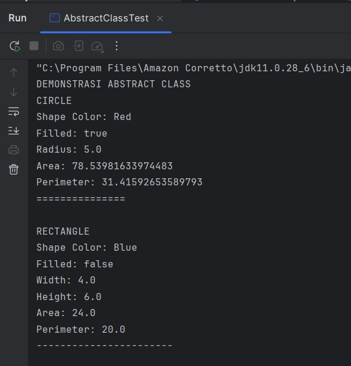
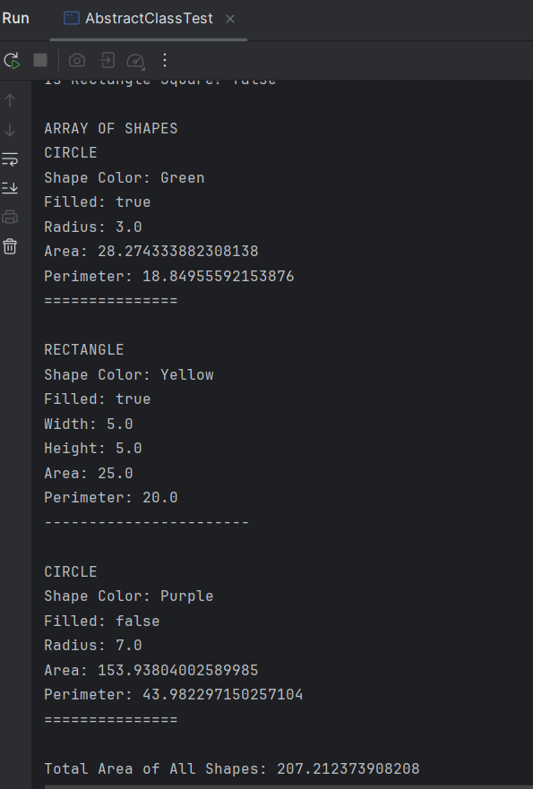
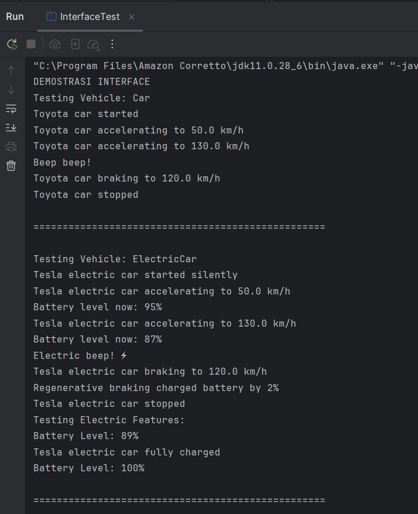
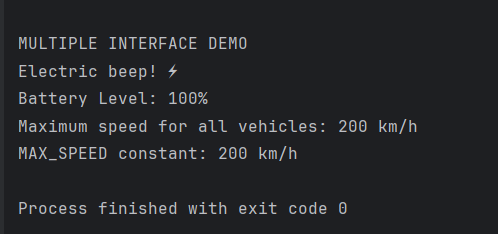
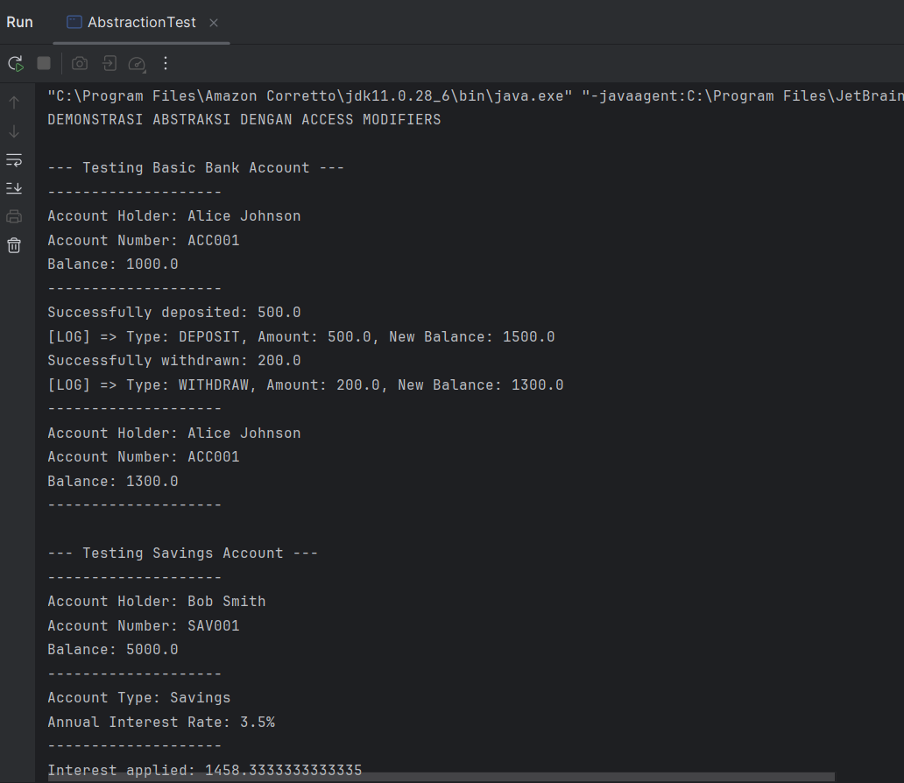
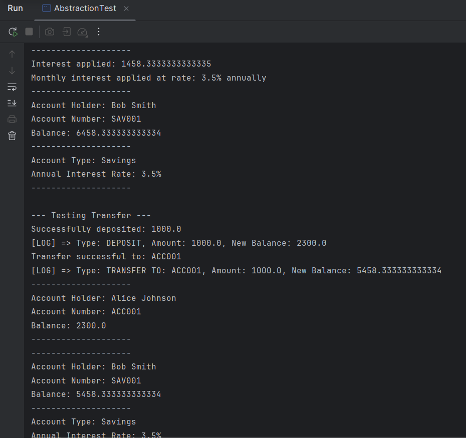
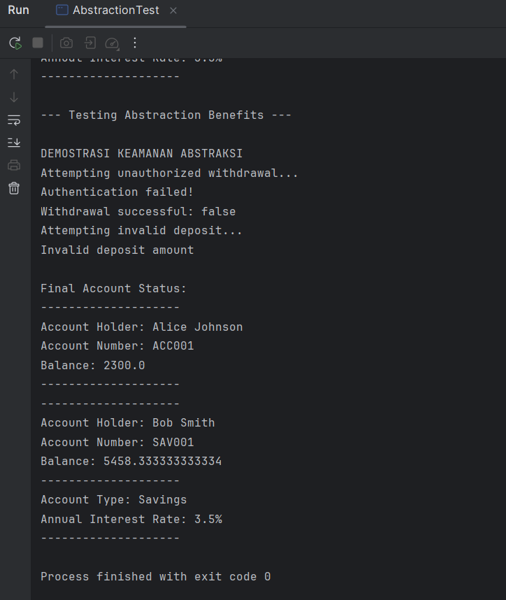

# Laporan Modul 8: Abstraction
**Mata Kuliah:** Praktikum Pemrograman Berorientasi Objek   
**Nama:** [Muna Nafisa]  
**NIM:** [2024573010048]  
**Kelas:** [TI2A]

## 1. Abstrak
Abstraksi adalah konsep dalam object-oriented programming (OOP) yang bertujuan untuk menyederhanakan kompleksitas sistem dengan menyembunyikan detail-detail teknis yang tidak perlu.

Inti dari abstraksi adalah tentang fokus pada 'apa' yang dilakukan suatu objek atau komponen, bukan 'bagaimana' hal itu dilakukan. Dalam praktiknya, abstraksi membantu programmer mendefinisikan interface, menunjukkan operasi yang dapat dilakukan oleh suatu objek, tanpa harus menyertakan detail tentang logika internal atau implementasi di balik operasi tersebut.

Misalnya, ketika menggunakan remote TV, kita hanya perlu tahu cara mengoperasikannya tanpa harus memahami mekanisme internalnya. Dalam OOP, objek menyediakan abstraksi yang menyembunyikan detail implementasi internal. Seperti remote TV, user hanya perlu tahu metode apa dari objek yang tersedia untuk dipanggil dan parameter input apa yang diperlukan untuk memicu operasi tertentu.

Dalam desain software, abstraksi berguna agar sistem dapat dibagi menjadi komponen-komponen yang lebih kecil dan lebih mudah dikelola, di mana masing-masing menyembunyikan kompleksitasnya sendiri. Hal ini tidak hanya memudahkan proses pengembangan, tetapi juga memfasilitasi maintenance dan testing software.

Selain itu, abstraksi juga bisa dipakai untuk mengubah implementasi internal suatu komponen tanpa memengaruhi komponen lain yang berinteraksi dengan komponen tersebut, asalkan interface yang digunakan tetap konsisten.

#### Langkah Praktikum

**Praktikum 1: Memahami Abstract Class dan Abstract Method**

1. Buat sebuah package baru di dalam package modul_8 dengan nama praktikum_1
   2. Buat abstract class Shape:

                       package modul_8.praktikum1;
            
            public abstract class Shape {
            protected String color;
            protected boolean filled;
            
                // Constructor
                public Shape(String color, boolean filled) {
                    this.color = color;
                    this.filled = filled;
                }
            
                // Abstract methods
                public abstract double calculateArea();
                public abstract double calculatePerimeter();
            
                // Concrete methods
                public String getColor() {
                    return color;
                }
            
                public void setColor(String color) {
                    this.color = color;
                }
            
                public boolean isFilled() {
                    return filled;
                }
            
                public void setFilled(boolean filled) {
                    this.filled = filled;
                }
            
                public void displayInfo() {
                    System.out.println("Shape Color: " + color);
                    System.out.println("Filled: " + filled);
                }
            }

3. Buat class Circle yang mewarisi Shape:

                    package modul_8.praktikum1;
            
         public class Circle extends Shape {
         private double radius;
            
             public Circle(String color, boolean filled, double radius) {
                 super(color, filled);
                 this.radius = radius;
             }
            
             // Implementasi abstract methods
             @Override
             public double calculateArea() {
                 return Math.PI * radius * radius;
             }
            
             @Override
             public double calculatePerimeter() {
                 return 2 * Math.PI * radius;
             }
            
             // Override display method
             @Override
             public void displayInfo() {
                 System.out.println("CIRCLE");
                 super.displayInfo();
                 System.out.println("Radius: " + radius);
                 System.out.println("Area: " + calculateArea());
                 System.out.println("Perimeter: " + calculatePerimeter());
                 System.out.println("===============");
             }
            
             // Method khusus
             public double getDiameter() {
                 return 2 * radius;
             }
         }

4. Buat class Rectangle yang mewarisi Shape:

    package modul_8.praktikum1;
    
    public class Rectangle extends Shape {
    private double width;
    private double height;
    
        public Rectangle(String color, boolean filled, double width, double height) {
            super(color, filled);
            this.width = width;
            this.height = height;
        }
    
        @Override
        public double calculateArea() {
            return width * height;
        }
    
        @Override
        public double calculatePerimeter() {
            return 2 * (width + height);
        }
    
        @Override
        public void displayInfo() {
            System.out.println("RECTANGLE");
            super.displayInfo();
            System.out.println("Width: " + width);
            System.out.println("Height: " + height);
            System.out.println("Area: " + calculateArea());
            System.out.println("Perimeter: " + calculatePerimeter());
            System.out.println("-----------------------");
        }
    
        public boolean isSquare() {
            return width == height;
        }
    }
5. Buat class AbstractClassTest untuk testing:

    package modul_8.praktikum1;
    
    public class AbstractClassTest {
    public static void main(String[] args) {
    
            Circle circle = new Circle("Red", true, 5.0);
            Rectangle rectangle = new Rectangle("Blue", false, 4.0, 6.0);
    
            System.out.println("DEMONSTRASI ABSTRACT CLASS");
    
            Shape shape1 = circle;
            Shape shape2 = rectangle;
    
            shape1.displayInfo();
            System.out.println();
    
            shape2.displayInfo();
            System.out.println();
    
            System.out.println("Circle Diameter: " + circle.getDiameter());
            System.out.println("Is Rectangle Square? " + rectangle.isSquare());
    
            System.out.println("\nARRAY OF SHAPES");
            Shape[] shapes = new Shape[3];
            shapes[0] = new Circle("Green", true, 3.0);
            shapes[1] = new Rectangle("Yellow", true, 5.0, 5.0);
            shapes[2] = new Circle("Purple", false, 7.0);
    
            double totalArea = 0;
            for (Shape shape : shapes) {
                shape.displayInfo();
                totalArea += shape.calculateArea();
                System.out.println();
            }
    
            System.out.println("Total Area of All Shapes: " + totalArea);
        }
    }

6. Jalankan program

**Praktikum 2: Memahami Interface**

1. Buat sebuah package baru di dalam package modul_8 dengan nama praktikum_2
2. Buat interface Vehicle:

        package modul_8.praktikum2;
        
        public interface Vehicle {
        // Constant fields (public static final by default)
        int MAX_SPEED = 200;
        
            // Abstract methods (public abstract by default)
            void start();
            void stop();
            void accelerate(double speed);
            void brake();
        
            // Default method (Java 8+)
            default void honk() {
                System.out.println("Beep beep!");
            }
        
            // Static method (Java 8+)
            static void displayMaxSpeed() {
                System.out.println("Maximum speed for all vehicles: " + MAX_SPEED + " km/h");
            }
        }
3. Buat interface Electric:

        package modul_8.praktikum2;
        
        public interface Electric {
        void charge();
        int getBatteryLevel();
        void setBatteryLevel(int level);
        
            default void displayBatteryInfo() {
                System.out.println("Battery Level: " + getBatteryLevel() + "%");
            }
        }

4. Buat class Car yang mengimplementasi Vehicle:

        package modul_8.praktikum2;
        
        public class Car implements Vehicle {
        private String brand;
        private double currentSpeed;
        private boolean isRunning;
        
            public Car(String brand) {
                this.brand = brand;
                this.currentSpeed = 0;
                this.isRunning = false;
            }
        
            @Override
            public void start() {
                if (!isRunning) {
                    isRunning = true;
                    System.out.println(brand + " car started");
                } else {
                    System.out.println(brand + " car is already running");
                }
            }
        
            @Override
            public void stop() {
                if (isRunning) {
                    isRunning = false;
                    currentSpeed = 0;
                    System.out.println(brand + " car stopped");
                } else {
                    System.out.println(brand + " car is already stopped");
                }
            }
        
            @Override
            public void accelerate(double speed) {
                if (isRunning) {
                    currentSpeed += speed;
                    if (currentSpeed > MAX_SPEED)
                        currentSpeed = MAX_SPEED;
        
                    System.out.println(brand + " car accelerating to " + currentSpeed + " km/h");
                } else {
                    System.out.println("Please start the car first");
                }
            }
        
            @Override
            public void brake() {
                if (currentSpeed > 0) {
                    currentSpeed -= 10;
                    if (currentSpeed < 0) currentSpeed = 0;
        
                    System.out.println(brand + " car braking to " + currentSpeed + " km/h");
                } else {
                    System.out.println(brand + " car is already stopped");
                }
            }
        
            // Getter methods
            public String getBrand() { return brand; }
            public double getCurrentSpeed() { return currentSpeed; }
            public boolean isRunning() { return isRunning; }
        }

5. Buat class ElectricCar yang mengimplementasi kedua interface:

        package modul_8.praktikum2;
        
        public class ElectricCar implements Vehicle, Electric {
        private String brand;
        private double currentSpeed;
        private boolean isRunning;
        private int batteryLevel;
        
            public ElectricCar(String brand) {
                this.brand = brand;
                this.currentSpeed = 0;
                this.isRunning = false;
                this.batteryLevel = 100; // Fully charged
            }
        
            // Implement Vehicle interface methods
            @Override
            public void start() {
                if (batteryLevel > 0) {
                    if (!isRunning) {
                        isRunning = true;
                        System.out.println(brand + " electric car started silently");
                    } else {
                        System.out.println(brand + " electric car is already running");
                    }
                } else {
                    System.out.println("Cannot start the car. Battery is empty. Please charge first.");
                }
            }
        
            @Override
            public void stop() {
                if (isRunning) {
                    isRunning = false;
                    currentSpeed = 0;
                    System.out.println(brand + " electric car stopped");
                } else {
                    System.out.println(brand + " electric car is already stopped");
                }
            }
        
            @Override
            public void accelerate(double speed) {
                if (isRunning && batteryLevel > 0) {
                    currentSpeed += speed;
        
                    // Battery consumption
                    batteryLevel -= (int)(speed / 10);
                    if (batteryLevel < 0) batteryLevel = 0;
        
                    if (currentSpeed > MAX_SPEED) currentSpeed = MAX_SPEED;
        
                    System.out.println(brand + " electric car accelerating to " + currentSpeed + " km/h");
                    System.out.println("Battery level now: " + batteryLevel + "%");
                } else {
                    System.out.println("Please start the car first");
                }
            }
        
            @Override
            public void brake() {
                if (currentSpeed > 0) {
                    currentSpeed -= 10;
                    if (currentSpeed < 0) currentSpeed = 0;
        
                    System.out.println(brand + " electric car braking to " + currentSpeed + " km/h");
        
                    // Regenerative braking: battery gains slightly
                    batteryLevel += 2;
                    if (batteryLevel > 100) batteryLevel = 100;
        
                    System.out.println("Regenerative braking charged battery by 2%");
                } else {
                    System.out.println(brand + " electric car is already stopped");
                }
            }
        
            // Override default method
            @Override
            public void honk() {
                System.out.println("Electric beep! ⚡");
            }
        
            // Electric interface methods
            @Override
            public void charge() {
                batteryLevel = 100;
                System.out.println(brand + " electric car fully charged");
            }
        
            @Override
            public int getBatteryLevel() {
                return batteryLevel;
            }
        
            @Override
            public void setBatteryLevel(int level) {
                if (level >= 0 && level <= 100) {
                    batteryLevel = level;
                } else {
                    System.out.println("Battery level must be between 0 and 100%");
                }
            }
        
            public String getBrand() { return brand; }
            public double getCurrentSpeed() { return currentSpeed; }
            public boolean isRunning() { return isRunning; }
        }

6. Buat class InterfaceTest untuk testing:

        package modul_8.praktikum2;
        
        public class InterfaceTest {
        public static void main(String[] args) {
        System.out.println("DEMOSTRASI INTERFACE");
        
                // Test regular car
                Car car = new Car("Toyota");
                testVehicle(car);
        
                System.out.println("\n" + "=".repeat(50) + "\n");
        
                // Test electric car
                ElectricCar electricCar = new ElectricCar("Tesla");
                testVehicle(electricCar);
                testElectric(electricCar);
        
                System.out.println("\n" + "=".repeat(50) + "\n");
        
                // Demonstrasi multiple interface implementation
                System.out.println("MULTIPLE INTERFACE DEMO");
                electricCar.honk(); // Overridden default method
                electricCar.displayBatteryInfo(); // Default method from Electric interface
        
                // Static method call
                Vehicle.displayMaxSpeed();
        
                // Interface constants
                System.out.println("MAX_SPEED constant: " + Vehicle.MAX_SPEED + " km/h");
            }
        
            public static void testVehicle(Vehicle vehicle) {
                System.out.println("Testing Vehicle: " + vehicle.getClass().getSimpleName());
                vehicle.start();
                vehicle.accelerate(50);
                vehicle.accelerate(80);
                vehicle.honk(); // Default method
                vehicle.brake();
                vehicle.stop();
            }
        
            public static void testElectric(Electric electric) {
                System.out.println("Testing Electric Features:");
                electric.displayBatteryInfo();
                electric.charge();
                electric.displayBatteryInfo();
            }
        }

7. Jalankan program

**Praktikum 3: Abstraksi dengan Access Modifiers**

1. Buat sebuah package baru di dalam package modul_8 dengan nama praktikum_3
2. Buat class BankAccount yang mengimplementasi abstraksi:

    package modul_8.praktikum3;
    
    public class BankAccount {
    // Private fields - hidden from outside world
    private String accountNumber;
    private String accountHolder;
    private double balance;
    private String password;
    
        // Constructor
        public BankAccount(String accountNumber, String accountHolder, double initialBalance, String password) {
            this.accountNumber = accountNumber;
            this.accountHolder = accountHolder;
            this.balance = initialBalance;
            this.password = password;
        }
    
        // Public method - interface to the outside world
        public double getBalance() {
            return balance;
        }
    
        public String getAccountNumber() {
            return accountNumber;
        }
    
        public String getAccountHolder() {
            return accountHolder;
        }
    
        public void deposit(double amount) {
            if (amount > 0) {
                balance += amount;
                System.out.println("Successfully deposited: " + amount);
                logTransaction("DEPOSIT", amount);
            } else {
                System.out.println("Invalid deposit amount");
            }
        }
    
        public boolean withdraw(double amount, String inputPassword) {
            if (authenticate(inputPassword)) {
                if (amount > 0 && amount <= balance) {
                    balance -= amount;
                    System.out.println("Successfully withdrawn: " + amount);
                    logTransaction("WITHDRAW", amount);
                    return true;
                } else {
                    System.out.println("Invalid withdraw amount or insufficient funds");
                }
            } else {
                System.out.println("Authentication failed!");
            }
            return false;
        }
    
        public boolean transfer(BankAccount recipient, double amount, String inputPassword) {
            if (authenticate(inputPassword)) {
                if (amount > 0 && amount <= balance) {
                    balance -= amount;
                    recipient.deposit(amount);
                    System.out.println("Transfer successful to: " + recipient.getAccountNumber());
                    logTransaction("TRANSFER TO: " + recipient.getAccountNumber(), amount);
                    return true;
                }
            }
            return false;
        }
    
        // Private method - hidden implementation detail
        private boolean authenticate(String inputPassword) {
            return this.password.equals(inputPassword);
        }
    
        // Protected method - visible to subclasses
        protected void applyInterest(double rate) {
            double interest = balance * rate;
            balance += interest;
            System.out.println("Interest applied: " + interest);
        }
    
        protected void logTransaction(String type, double amount) {
            System.out.println("[LOG] => Type: " + type + ", Amount: " + amount + ", New Balance: " + balance);
        }
    
        // Public method: shows account info (without sensitive data)
        public void displayAccountInfo() {
            System.out.println("--------------------");
            System.out.println("Account Holder: " + accountHolder);
            System.out.println("Account Number: " + accountNumber);
            System.out.println("Balance: " + balance);
            System.out.println("--------------------");
        }
    }

3. Buat class SavingsAccount yang mewarisi BankAccount:

    package modul_8.praktikum3;
    
    public class SavingsAccount extends BankAccount {
    private double interestRate;
    
        public SavingsAccount(String accountNumber, String accountHolder,
                              double initialBalance, String password, double interestRate) {
            super(accountNumber, accountHolder, initialBalance, password);
            this.interestRate = interestRate;
        }
    
        // Public method to apply interest
        public void applyMonthlyInterest() {
            applyInterest(interestRate / 12); // Calling protected method from parent
            System.out.println("Monthly interest applied at rate: " + interestRate + "% annually");
        }
    
        @Override
        public void displayAccountInfo() {
            super.displayAccountInfo();
            System.out.println("Account Type: Savings");
            System.out.println("Annual Interest Rate: " + interestRate + "%");
            System.out.println("--------------------");
        }
    }

4. Buat class AbstractionTest untuk testing:

        package modul_8.praktikum3;
        
        public class AbstractionTest {
        public static void main(String[] args) {
        System.out.println("DEMONSTRASI ABSTRAKSI DENGAN ACCESS MODIFIERS");
        
                // Create accounts
                BankAccount account1 = new BankAccount("ACC001", "Alice Johnson", 1000.0, "pass123");
                SavingsAccount account2 = new SavingsAccount("SAV001", "Bob Smith", 5000.0, "save456", 3.5);
        
                // Test public interface
                System.out.println("\n--- Testing Basic Bank Account ---");
                account1.displayAccountInfo();
                account1.deposit(500.0);
                account1.withdraw(200.0, "pass123");
                account1.displayAccountInfo();
        
                System.out.println("\n--- Testing Savings Account ---");
                account2.displayAccountInfo();
                account2.applyMonthlyInterest();
                account2.displayAccountInfo();
        
                System.out.println("\n--- Testing Transfer ---");
                account2.transfer(account1, 1000.0, "save456");
                account1.displayAccountInfo();
                account2.displayAccountInfo();
        
                System.out.println("\n--- Testing Abstraction Benefits ---");
        
                // Cannot access private members directly
                // System.out.println(account1.balance); // ERROR - private field
                // System.out.println(account1.password); // ERROR - private field
        
                // Cannot call private methods
                // account1.authenticate("pass123"); // ERROR - private method
                // account1.logTransaction("TEST", 100); // ERROR - private method
        
                // Protected method is accessible through public interface in subclass
                // account1.applyInterest(5.0); // ERROR - protected method not accessible outside hierarchy
        
                System.out.println("\nDEMOSTRASI KEAMANAN ABSTRAKSI");
        
                // Attempt unauthorized access
                System.out.println("Attempting unauthorized withdrawal...");
                boolean success = account1.withdraw(1000.0, "wrongpassword");
                System.out.println("Withdrawal successful: " + success);
        
                System.out.println("Attempting invalid deposit...");
                account1.deposit(-100.0); // Invalid amount
        
                System.out.println("\nFinal Account Status:");
                account1.displayAccountInfo();
                account2.displayAccountInfo();
            }
        }

#### Screenshoot Hasil

#### Analisa dan Pembahasan

**PRAKTIKUM 1**

**1.Class Circle**

1. Class Declaration

        public class Circle extends Shape

- Circle adalah subclass dari abstract class Shape.

- Karena Shape class abstrak, wajib mengoverride method abstract di dalamnya.

2. Attribute

          private double radius;

- Menyimpan nilai jari-jari lingkaran.

- private → hanya bisa diakses dari dalam class.

3. Constructor

        public Circle(String color, boolean filled, double radius) {
        super(color, filled);
        this.radius = radius;
        }
- Menerima 3 parameter: color, filled, dan radius.

- super(color, filled) → memanggil constructor milik Shape.

  - Berarti Shape punya atribut warna dan apakah shape tersebut "filled" atau tidak.

- this.radius = radius → menyimpan radius ke atribut class.

4. Override Method Abstract dari Shape

a. calculateArea

    @Override
    public double calculateArea() {
    return Math.PI * radius * radius;
    }
- Menghitung luas lingkaran: π r²

- Implementasi konkret dari method abstract di class induk.

b. calculatePerimeter

    @Override
    public double calculatePerimeter() {
    return 2 * Math.PI * radius;
    }
- Menghitung keliling lingkaran: 2 π r

5. Override displayInfo

        @Override
        public void displayInfo() {
        System.out.println("CIRCLE");
        super.displayInfo();
        System.out.println("Radius: " + radius);
        System.out.println("Area: " + calculateArea());
        System.out.println("Perimeter: " + calculatePerimeter());
        System.out.println("===============");
        }
- Menampilkan info lingkaran.

- super.displayInfo() → memanggil method display dari class Shape.

- Biasanya berisi informasi color dan filled.

- Menampilkan radius, luas, dan keliling.

- Bagus untuk menunjukkan polimorfisme runtime: tiap shape punya cara tampil berbeda.

6. Method Khusus

        public double getDiameter() {
        return 2 * radius;
        }
- Method tambahan yang hanya dimiliki lingkaran.

- Menghitung diameter = 2r.

**2. CLASS Rectangle**

1. Class Declaration

        public class Rectangle extends Shape

- Rectangle adalah subclass dari abstract class Shape.

- Karena Shape adalah abstract, maka class ini wajib override method abstract calculateArea() dan calculatePerimeter().

2. Attribute

        private double width;
        private double height;

- width → lebar persegi panjang

- height → tinggi persegi panjang

- Keduanya private, hanya bisa diakses dalam class.

3. Constructor

        public Rectangle(String color, boolean filled, double width, double height) {
        super(color, filled);
        this.width = width;
        this.height = height;
        }

- Mengambil data dari user: color, filled, width, height.

- super(color, filled) → memanggil constructor di class induk (Shape).
Ini mengisi atribut warna dan kondisi filled.

- this.width = width dan this.height = height menyimpan nilai ke atribut class.

4. Implementasi Method Abstract

a. Menghitung luas

    @Override
    public double calculateArea() {
    return width * height;
    }
b. Menghitung keliling

    @Override
    public double calculatePerimeter() {
    return 2 * (width + height);
    }

5. Override displayInfo()

        @Override
        public void displayInfo() {
        System.out.println("RECTANGLE");
        super.displayInfo();
        System.out.println("Width: " + width);
        System.out.println("Height: " + height);
        System.out.println("Area: " + calculateArea());
        System.out.println("Perimeter: " + calculatePerimeter());
        System.out.println("-----------------------");
        }

- Fungsi ini:

    - Menampilkan judul “RECTANGLE”.
    
    - Memanggil method displayInfo() milik Shape → biasanya menampilkan color & filled.
    
    - Menampilkan atribut width, height, luas, dan keliling.
    
    - Dipakai saat program menampilkan info objek.

6. Method Tambahan: isSquare()

        public boolean isSquare() {
        return width == height;
        }

- Method ini mengecek apakah persegi panjang adalah persegi.

- Jika lebar == tinggi → return true.

Contoh:

- width = 5, height = 5 → persegi → true

- width = 5, height = 7 → bukan persegi → false

Method ini hanya dimiliki Rectangle, bukan Shape lain.

**3. Class shape**

1. Class Declaration

        public abstract class Shape

- Class ini adalah abstract class, artinya:

    - Tidak bisa dibuat objek langsung → new Shape() 
    
    - Hanya bisa digunakan sebagai blueprint untuk subclass (Circle, Rectangle, Triangle, dll).
    
    - Wajib memiliki minimal satu abstract method.

Merupakan “kerangka dasar” semua bentuk bangun.

2. Atribut

        protected String color;
        protected boolean filled;

- color → warna dari shape.

- filled → apakah bentuk tersebut terisi (fill) atau tidak.

Kenapa protected?

- Agar atribut dapat diakses oleh subclass (Circle, Rectangle, dll), tetapi tetap tidak sepenuhnya public.

Ini adalah contoh encapsulation yang tepat untuk hierarki OOP.

3. Constructor

        public Shape(String color, boolean filled) {
        this.color = color;
        this.filled = filled;
        }

- Constructor menerima warna dan kondisi filled.

- Diset sekali saat objek turunan dibuat.

4. Abstract Methods

        public abstract double calculateArea();
        public abstract double calculatePerimeter();

- Semua subclass WAJIB mengimplementasikan:

  - Luas

  - Keliling

Contoh implementasi di Circle:

    public double calculateArea() {
    return Math.PI * radius * radius;
    }
Contoh di Rectangle:

        public double calculateArea() {
        return width * height;
        }

Ini bagian inti dari polimorfisme → setiap bentuk punya cara sendiri untuk menghitung luas & keliling.

5. Concrete Methods (bukan abstract)

Getter dan Setter:

    public String getColor() { ... }
    public void setColor(String color) { ... }
    public boolean isFilled() { ... }
    public void setFilled(boolean filled) { ... }

- Memberikan akses aman ke atribut.

- Sesuai prinsip Encapsulation.

6. Method displayInfo()

        public void displayInfo() {
        System.out.println("Shape Color: " + color);
        System.out.println("Filled: " + filled);
        }

Fungsi:

- Menampilkan info dasar sebuah shape.

- Method ini bisa:

    - Digunakan langsung oleh subclass → seperti Circle dan Rectangle memanggil super.displayInfo()

    - Atau dioverride jika subclass ingin tampil beda.

Contoh di Circle:

    System.out.println("CIRCLE");
    super.displayInfo();

Jadi displayInfo() memberi dasar info — subclass menambah detail lain.

**4. CLASS AbstractClassTest**

1. Membuat Objek Circle dan Rectangle

        Circle circle = new Circle("Red", true, 5.0);
        Rectangle rectangle = new Rectangle("Blue", false, 4.0, 6.0);
- Membuat objek Circle dan Rectangle dengan warna, status filled, dan ukuran.

- Ini menggunakan constructor yang sudah dibuat di masing-masing class.

2. Demonstrasi Abstract Class + Polymorphism

        Shape shape1 = circle;
        Shape shape2 = rectangle;

- Variabel tipe induk (Shape) bisa menyimpan objek subclass (Circle dan Rectangle).

- Ini polimorfisme runtime:
Method yang dipanggil mengikuti objek aslinya (Circle/Rectangle), bukan tipe referensinya.

Contoh:

    shape1.displayInfo(); // Punya Circle
    shape2.displayInfo(); // Punya Rectangle

Walaupun tipe variabel adalah Shape, method yang berjalan tetap milik subclass.

3. Memanggil Method Polimorfik

        shape1.displayInfo();
        shape2.displayInfo();

- Akan memanggil override method displayInfo() di masing-masing class:

    - Circle → menampilkan radius, area, perimeter
    
    - Rectangle → menampilkan width, height, area, perimeter

4. Memanggil Method Khusus Subclass

        System.out.println("Circle Diameter: " + circle.getDiameter());
        System.out.println("Is Rectangle Square? " + rectangle.isSquare());

Ini hanya bisa dipanggil dari objek aslinya, bukan variabel Shape.

Karena:
    
- getDiameter() hanya dimiliki Circle

- isSquare() hanya dimiliki Rectangle
Jika dipanggil lewat shape1, error.

5. Demonstrasi Array of Shapes (Polymorphism Level Lanjut)

        Shape[] shapes = new Shape[3];
        shapes[0] = new Circle("Green", true, 3.0);
        shapes[1] = new Rectangle("Yellow", true, 5.0, 5.0);
        shapes[2] = new Circle("Purple", false, 7.0);
Ini sangat penting:

- Array bertipe Shape

- Isinya berbagai objek turunan (Circle dan Rectangle)

- Ini menunjukkan polimorfisme di koleksi objek

6. Looping Polimorfik

        for (Shape shape : shapes) {
        shape.displayInfo();
        totalArea += shape.calculateArea();
        System.out.println();
        }

- Kekuatan polimorfisme:

    - shape.displayInfo() memanggil versi Circle atau Rectangle sesuai objek dalam array.

    - shape.calculateArea() akan otomatis menghitung luas sesuai tipe objeknya.

Walaupun variabelnya bertipe Shape, method di subclass yang berjalan.

7. Menjumlahkan Luas Semua Objek

        System.out.println("Total Area of All Shapes: " + totalArea);

- Menggabungkan seluruh luas dari objek Circle dan Rectangle.

- Menunjukkan kegunaan polimorfisme untuk operasi generic.

**Praktikum 2: Memahami Interface**

**1. Class Car**

1. Class Declaration

    public class Car implements Vehicle

- Car mengimplementasikan interface Vehicle.

- Artinya class ini wajib meng-override semua method yang ada di interface.

- Car bukan abstract → semua method harus lengkap.

2. Atribut

a. brand

- Menyimpan merk mobil (contoh: Toyota, Honda)

b. currentSpeed

- Menyimpan kecepatan mobil saat ini.

c. isRunning

- Menyimpan status apakah mobil sedang menyala atau tidak.

Atribut menggunakan private → encapsulation.

3. Constructor

        public Car(String brand) {
        this.brand = brand;
        this.currentSpeed = 0;
        this.isRunning = false;
        }
- Saat objek Car dibuat:

    - Speed = 0

    - Mobil dalam keadaan off

    - Brand ditentukan dari parameter

4. Implementasi Method dari Interface Vehicle

A. start()

    @Override
    public void start() {
    if (!isRunning) {
    isRunning = true;
    System.out.println(brand + " car started");
    } else {
    System.out.println(brand + " car is already running");
    }
    }

- Menyalakan mobil jika belum menyala.

- Mengubah isRunning = true.

- Jika sudah menyala, tampilkan pesan bahwa mobil sudah hidup.

B. stop()

    @Override
    public void stop() {
    if (isRunning) {
    isRunning = false;
    currentSpeed = 0;
    System.out.println(brand + " car stopped");
    } else {
    System.out.println(brand + " car is already stopped");
    }
    }

- Mematikan mobil jika sedang hidup.

- Speed otomatis menjadi 0.

- Jika sudah mati → tampilkan pesan.

C. accelerate(double speed)

    @Override
    public void accelerate(double speed) {
    if (isRunning) {
    currentSpeed += speed;
    if (currentSpeed > MAX_SPEED)
    currentSpeed = MAX_SPEED;
    
            System.out.println(brand + " car accelerating to " + currentSpeed + " km/h");
        } else {
            System.out.println("Please start the car first");
        }
    }
- Mobil hanya bisa nambah kecepatan jika hidup.

- Menambah speed sebesar parameter.

- Jika lebih tinggi dari MAX_SPEED, otomatis diset ke MAX_SPEED.

MAX_SPEED adalah constant dari interface Vehicle.

D. brake()

    @Override
    public void brake() {
    if (currentSpeed > 0) {
    currentSpeed -= 10;
    if (currentSpeed < 0) currentSpeed = 0;
    
            System.out.println(brand + " car braking to " + currentSpeed + " km/h");
        } else {
            System.out.println(brand + " car is already stopped");
        }
    }
- Mengurangi speed 10 km/h setiap kali rem ditekan.

- Jika speed < 0, set ke 0.

- Jika speed sudah 0, tampilkan pesan bahwa mobil sudah berhenti.

5. Getter Methods

        public String getBrand() { return brand; }
        public double getCurrentSpeed() { return currentSpeed; }
        public boolean isRunning() { return isRunning; }

- Mengambil data private variable sesuai prinsip encapsulation.

- Tidak ada setter → keamanan lebih terjaga.

**2. Class Electric**

1. Deklarasi Interface

        public interface Electric {

- Electric adalah interface, bukan class.

- Interface digunakan untuk menentukan kontrak perilaku.

- Semua class yang mengimplementasi Electric wajib menyediakan method‐method yang didefinisikan (kecuali method default).

2. Method Abstract

Interface ini memiliki 3 method abstract:

2.1. void charge();

- Method tanpa body → harus diimplementasikan oleh class yang memakai interface ini.

- Fungsinya biasanya:

    - Mengisi baterai

    - Atau menjalankan proses charging

2.2. int getBatteryLevel();

- Method getter untuk mengambil level baterai saat ini.

- Return tipe int, contoh nilai: 0–100.

2.3. void setBatteryLevel(int level);

- Method setter untuk mengubah nilai baterai.

- Umumnya digunakan untuk update level saat charging atau memakai energi.

4. Default Method

        default void displayBatteryInfo() {
        System.out.println("Battery Level: " + getBatteryLevel() + "%");
        }
- Ini adalah default method, fitur sejak Java 8.

- Default method memiliki implementasi sehingga:

  - Class turunan tidak wajib override.

  - Tapi boleh override kalau ingin tampilan berbeda.

- Method ini otomatis memanggil getBatteryLevel() dan menampilkan informasi baterai.

Contoh Penggunaan di Class

    public class ElectricCar implements Electric {
    private int batteryLevel;
    
        public ElectricCar() {
            batteryLevel = 50;
        }
    
        @Override
        public void charge() {
            batteryLevel = 100;
        }
    
        @Override
        public int getBatteryLevel() {
            return batteryLevel;
        }
    
        @Override
        public void setBatteryLevel(int level) {
            batteryLevel = level;
        }
    }

**3. CLASS ElectricCar**

1. Atribut / Properti

    private String brand;
    private double currentSpeed;
    private boolean isRunning;
    private int batteryLevel;

- brand → merek mobil, contoh: Tesla, Wuling, Hyundai

- currentSpeed → kecepatan mobil saat ini

- isRunning → menandakan mobil hidup / tidak

- batteryLevel → level baterai (0–100%)

2. construktor

        public ElectricCar(String brand) {
        this.brand = brand;
        this.currentSpeed = 0;
        this.isRunning = false;
        this.batteryLevel = 100;
        }

Saat objek dibuat:
- Kecepatan awal = 0

- Mesin = mati

- Baterai = 100% (full charge)

- Brand diambil dari parameter

3. Implementasi Interface Vehicle

1. start()

        if (batteryLevel > 0) {
        if (!isRunning) {
        isRunning = true;
        System.out.println(brand + " electric car started silently");
        }
        }
- Mobil hanya bisa menyala jika baterai > 0

- Menggunakan kondisi untuk mencegah start dua kali

- Output khas mobil listrik: silent start

2. stop()

        if (isRunning) {
        isRunning = false;
        currentSpeed = 0;
        System.out.println(brand + " electric car stopped");
        }
- Mesin dimatikan

- Kecepatan otomatis kembali ke 0

3. accelerate(double speed)

- Hanya bisa mempercepat ketika:

  - Mobil sedang berjalan (isRunning == true)

  - Baterai masih ada

- Menambah kecepatan berdasarkan parameter speed

- Mengkonsumsi baterai:

      batteryLevel -= (int)(speed / 10);

- Ada batas kecepatan MAX_SPEED (dari interface Vehicle)

- Menampilkan update kecepatan dan baterai

Catatan OOP:

- Integrasi antara motor listrik dan konsumsi energi

- Logika realistis untuk kendaraan EV

4. brake()

Penjelasan penting:

- Brem mengurangi kecepatan 10 km/h

- Ada batas bawah 0

- Fitur Regenerative Braking

      batteryLevel += 2;

Menambah baterai saat pengereman → sesuai konsep mobil listrik a

5. honk() — Override Default Method

Karena Vehicle mungkin punya default honk, maka class ini mengoverride:

    @Override
    public void honk() {
    System.out.println("Electric beep! ⚡");
    }

Memberikan karakter khas suara mobil listrik.

4. Implementasi Interface Electric

1. charge()

         batteryLevel = 100;

- Mengisi baterai hingga penuh

- Output: mobil terisi penuh

2. getBatteryLevel()

Mengambil level baterai saat ini

3. setBatteryLevel(int level)

- Memastikan nilai baterai valid (0–100)

- Melindungi kendaraan dari input yang tidak mungkin

5. Getter Tambahan
  
            public String getBrand()
               public double getCurrentSpeed()
               public boolean isRunning()

- Tujuan:

    - Enkapsulasi

    - Pengambilan data objek tanpa memodifikasi

**4. CLASS Vehicle**

1. Constant Field (public static final)

        int MAX_SPEED = 200;

- Semua field di interface otomatis bersifat public static final, meskipun tidak ditulis.

- Artinya:

    - MAX_SPEED adalah konstanta bersama untuk semua kendaraan.

    - Tidak bisa diubah (final).

    - Bisa diakses langsung: Vehicle.MAX_SPEED.

- Fungsinya untuk memberikan boundary / limit kecepatan maksimum kendaraan.

2. Abstract Methods (public abstract default)

Semua method berikut harus diimplementasikan oleh class yang mengimplement Vehicle:

    void start();
    void stop();
    void accelerate(double speed);
    void brake();

Makna tiap method:

- Method
    - start()
    - stop()
    - accelerate(double speed)
    - brake()
-Fungsi
    - Menyalakan kendaraan
    - Mematikan kendaraan & set speed ke 0
    - Menambah kecepatan kendaraan
    - Mengurangi kecepatan
- Contohnya:

  - Car wajib punya cara menyalakan mesin dengan suara.

  - ElectricCar wajib punya cara menyalakan mobil secara “silent”.

3. Default Method (Java 8+)

            default void honk() {
            System.out.println("Beep beep!");
            }

- Default method memberikan implementasi bawaan untuk method interface.

- Class yang mengimplementasikan interface tidak wajib override.

- Bisa dioverride jika perlu, contoh ElectricCar:

        @Override
        public void honk() {
        System.out.println("Electric beep! ⚡");
        }

- Fungsinya:

  - Memberikan "behavior standar" untuk semua kendaraan.

  - Tidak memaksa class untuk mengimplementasinya.

4. Static Method

        static void displayMaxSpeed() {
        System.out.println("Maximum speed for all vehicles: " + MAX_SPEED + " km/h");
        }

- Static method hanya bisa dipanggil dari interface-nya, tidak dari objek.

Contoh:

    Vehicle.displayMaxSpeed();
- Memberikan fungsi utilitas umum untuk semua kendaraan.

Static method tidak diwariskan ke subclass.

Objek seperti Car atau ElectricCar tidak bisa memanggil:

    car.displayMaxSpeed(); 

5. Konsep OOP yang ditonjolkan

1. Abstraction

Interface menyembunyikan implementasi detail.
Class yang mengimplementasinya bertanggung jawab mendefinisikan cara bekerja.

2. Polymorphism

Objek dari berbagai class (Car, ElectricCar, dll) bisa diperlakukan sebagai Vehicle.

Contoh:

    Vehicle v = new ElectricCar("Tesla");
    v.start();   // polymorphism

- Inheritance via interface

Interface membentuk blueprint tanpa state.

- Encapsulation

Tidak disini, tapi class yang mengimplementasinya biasanya menerapkan enkapsulasi pada atribut.

**5. Class InterfaceTest**

1. Fungsi Utama

Program ini bertujuan mendemonstrasikan penggunaan interface, termasuk:

- Polymorphism dengan interface Vehicle

- Multiple interface (Vehicle + Electric)

- Default method

- Static method

- Interface constant

2. Bagian Utama Program
   a. Test mobil biasa (Car)

        Car car = new Car("Toyota");
        testVehicle(car);

- Objek Car diperlakukan sebagai Vehicle.

- Semua method interface (start, accelerate, brake, stop) dijalankan melalui polymorphism.

b. Test mobil listrik (ElectricCar)

    ElectricCar electricCar = new ElectricCar("Tesla");
    testVehicle(electricCar);
    testElectric(electricCar);

- ElectricCar dites sebagai Vehicle dan sebagai Electric.

- Menunjukkan kemampuan multiple interface implementation.

c. Demonstrasi fitur tambahan

    electricCar.honk();  
    electricCar.displayBatteryInfo();
    Vehicle.displayMaxSpeed();

- Override default method → honk() di ElectricCar

- Default method dari interface → displayBatteryInfo() (interface Electric)

- Static method interface → displayMaxSpeed()

- Access constant interface → MAX_SPEED

3. Metode Pembantu

- testVehicle(Vehicle vehicle)

    - Menunjukkan polymorphism.

    - Semua jenis kendaraan dipanggil dengan cara yang sama tanpa peduli class-nya.

- testElectric(Electric electric)

    - Khusus mengetes fitur baterai:

      - Cek level baterai

      - Charge

      - Cek level lagi

**Praktikum 3: Abstraksi dengan Access Modifiers**

**1. Class SavingsAccount**

1. Pewarisan dari BankAccount

        public class SavingsAccount extends BankAccount

SavingsAccount adalah subclass dari BankAccount, artinya mewarisi:
- nomor akun

- nama pemilik

- saldo

- password

- method deposit, withdraw, displayInfo, dll

2. Atribut Baru

         private double interestRate;

Menambahkan fitur baru khusus tabungan yaitu bunga tahunan.

3. construktor

        super(accountNumber, accountHolder, initialBalance, password);
        this.interestRate = interestRate;
- Memanggil konstruktor parent (BankAccount)

- Menyimpan bunga tahunan untuk akun tabungan.

4. applyMonthlyInterest()

          applyInterest(interestRate / 12);
- Mengakses protected method applyInterest() dari parent → diperbolehkan karena subclass.

- Menghitung bunga bulanan (annualRate / 12)

- Menambah bunga ke saldo secara otomatis.

- Menampilkan pesan penerapan bunga.

Ini menunjukkan pemanfaatan akses modifier protected dengan benar.

5. Override displayAccountInfo()

        super.displayAccountInfo();
        System.out.println("Account Type: Savings");
        System.out.println("Annual Interest Rate: " + interestRate + "%");

- Memperluas info akun dari parent.

- Menambahkan info khusus tabungan:

  - jenis akun

  - bunga tahunan

- Menunjukkan polymorphism overriding.

**2. Class BankAccount**

1. Atribut Private (Encapsulation)

        private String accountNumber;
        private String accountHolder;
        private double balance;
        private String password;

- Semua data penting bersifat private → tidak bisa diakses langsung dari luar.

- Menunjukkan encapsulation yang baik, terutama untuk password & saldo.

2. Konstruktor

        public BankAccount(...){
        this.accountNumber = accountNumber;
        this.accountHolder = accountHolder;
        this.balance = initialBalance;
        this.password = password;
        }
Menginisialisasi data akun saat pembuatan objek.

3. Public Method untuk Akses & Operasi

- Getter

    - getBalance(), getAccountNumber(), getAccountHolder()

    - Tidak ada getter untuk password → keamanan terjaga.

- deposit()

    - Menambah saldo jika amount > 0

    - Mencatat transaksi via logTransaction()

- withdraw()

    - Mengecek password dengan authenticate()

    - Mengecek saldo cukup

    - Mengurangi saldo

- transfer()

    - Menggunakan autentikasi

    - Mengurangi saldo pengirim

    - Memanggil deposit() pada akun penerima

    - Mencatat transaksi

Semua operasi penting dikontrol method publik → contoh good encapsulation.

4. Private Method

        private boolean authenticate(String inputPassword)

- Dipakai hanya oleh class ini.

- Menyembunyikan mekanisme login dari luar → keamanan.

5. Protected Methods (untuk subclass)

          protected void applyInterest(double rate)

- Bisa diakses oleh subclass seperti SavingsAccount

- Tidak bisa diakses oleh objek luar

logTransaction()

Digunakan untuk mencatat transaksi:

        protected void logTransaction(...)

6. Public displayAccountInfo()

        public void displayAccountInfo()

Menampilkan informasi akun tanpa memperlihatkan password → aman.

**3. CLASS Abstractiontest**

1. Pembuatan Objek

        BankAccount account1 = new BankAccount(...);
        SavingsAccount account2 = new SavingsAccount(...);

- Membuat akun biasa dan akun tabungan.

- Menunjukkan penggunaan inheritance (SavingsAccount extends BankAccount).

2. Demonstrasi Public Interface

Bagian ini menunjukkan method public yang dapat dipanggil:

- displayAccountInfo()

- deposit()

- withdraw()

- applyMonthlyInterest() (khusus SavingsAccount)

- transfer()

Ini membuktikan bahwa user hanya berinteraksi melalui antarmuka publik, bukan internal data.

3. Demonstrasi Access Modifiers

Kode yang dikomentari:

    // account1.balance;  // ERROR
    // account1.password; // ERROR
    // account1.authenticate(...); // ERROR
    // account1.logTransaction(...); // ERROR

- private field tidak bisa diakses dari luar

- private method tidak bisa dipanggil secara langsung

- protected method hanya bisa diakses oleh subclass, bukan di luar package atau hierarki

Ini memperlihatkan perlindungan data (Encapsulation).

4. Demonstrasi Kesalahan / Keamanan

        boolean success = account1.withdraw(1000.0, "wrongpassword");
        account1.deposit(-100.0);

Menunjukkan:

- Gagal saat password salah → autentikasi bekerja

- Deposit negatif ditolak → validasi data bekerja

5. Output Akhir

Program menampilkan status akun setelah semua operasi dilakukan untuk memastikan:

- proses berjalan

- saldo berubah sesuai operasi valid

- operasi tidak valid ditolak

## 3. Kesimpulan

Abstraction dalam Pemrograman Berorientasi Objek merupakan konsep yang menyembunyikan detail internal dan hanya menampilkan fungsionalitas penting kepada pengguna. Pada praktikum ini, konsep abstraksi diterapkan melalui penggunaan access modifiers (private, protected, public) dan pemisahan antara akses internal dan akses eksternal pada class.

Melalui percobaan pada class BankAccount dan SavingsAccount, dapat disimpulkan bahwa:

1. Abstraction meningkatkan keamanan data, karena atribut sensitif seperti balance dan password disembunyikan dengan modifier private, sehingga tidak bisa diakses atau diubah secara langsung dari luar class.

2. Penggunaan public methods seperti deposit(), withdraw(), dan transfer() menyediakan interface resmi yang aman untuk berinteraksi dengan objek tanpa perlu mengetahui detail implementasi di dalamnya.

3. Protected method seperti applyInterest() hanya dapat diakses oleh subclass, sehingga mendukung pewarisan sekaligus tetap menjaga keamanan struktur internal.

4. Abstraction membantu memisahkan logika internal (misalnya authentikasi dan pencatatan transaksi) dari proses yang digunakan oleh pengguna class, sehingga kode menjadi lebih terstruktur, mudah dipahami, dan mudah dikembangkan.

5. Dengan abstraksi, sistem menjadi lebih modular, aman, dan fleksibel untuk diperluas tanpa mempengaruhi pengguna class.

## 4. Referensi
https://hackmd.io/@mohdrzu/SJ8OEWfg-g